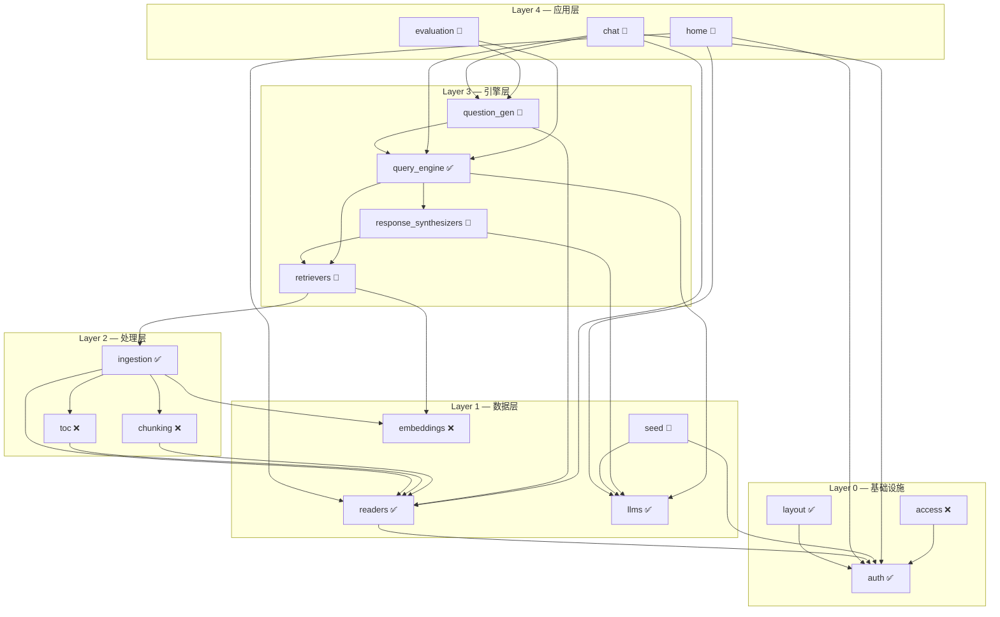
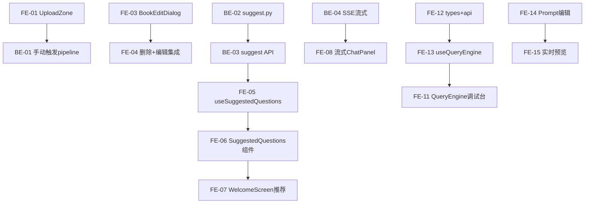
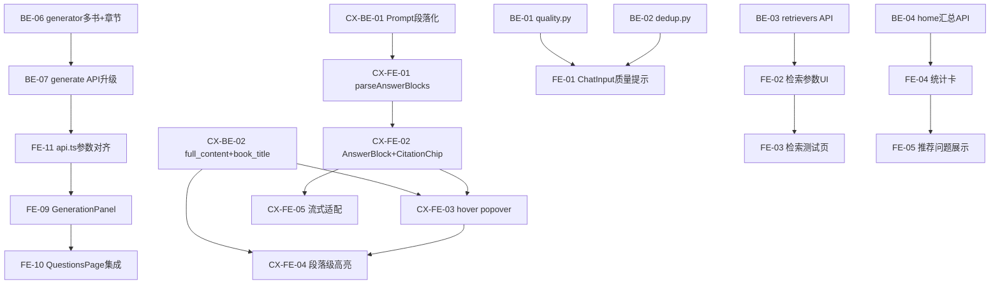
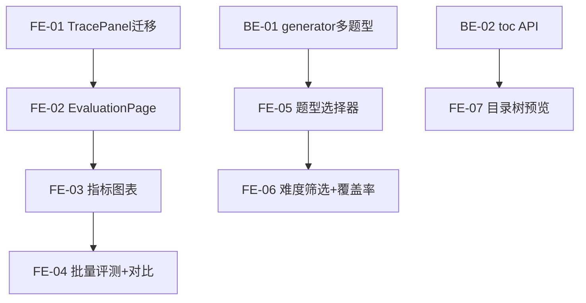

# Textbook-RAG v2 — 功能路线图

> 对照 [module-manifest.md](./module-manifest.md) 每个功能点，标注实际实现状态。
> 格式沿用 manifest 的 Layout / UI / UX / Func 维度，用 ✅ ❌ 标注。

**图例** — ✅ 已实现 · ❌ 未实现

---

## 核心产品洞察

> **如果用户不知道问什么好问题，对话就是扯犊子。**
>
> `question_gen` 的定位不是"后台出题工具"，而是 **chat 的上游供给系统**：
> 1. **问题推荐 (Suggest)** — 用户打开对话时，基于书本章节推荐高价值问题
> 2. **问题质量识别 (Quality)** — 判断用户问题是否有深度（浅层复述 / 深度理解 / 跨章关联）
> 3. **重复检测 (Dedup)** — 识别"老客"（重复/相似问题），引导用户深入而非重复

---

## LlamaIndex 对齐原则

> **在开发任何功能之前，先查 LlamaIndex 是否已有对应能力。**
>
> 参考源码：`.github/references/llama_index/llama-index-core/llama_index/core/`
>
> **已对齐** — ingestion (`IngestionPipeline`) · retrievers (`QueryFusionRetriever`) · response_synthesizers (`get_response_synthesizer`) · query_engine (`RetrieverQueryEngine`) · evaluation (`FaithfulnessEvaluator` + `RelevancyEvaluator` + `BatchEvalRunner`)
>
> **需对齐** — question_gen 数据访问层（当前直接 ChromaDB API 绕过 LlamaIndex） · retrievers 缺 Reranker (`LLMRerank` / `SentenceTransformerRerank`) · evaluation 缺扩展评估维度 (`ContextRelevancyEvaluator` / `AnswerRelevancyEvaluator`)
>
> **不需对齐** — readers (MinerUReader 是自定义 Reader，LlamaIndex 无 MinerU 集成) · toc (纯文本解析) · 前端全部模块

---

## 依赖关系图



> 箭头方向：A → B = "A 依赖 B"。被依赖最多的模块最先完善。

---

## 实施路线（四阶段）

### Sprint 1 — 端到端用户旅程闭环（约 3 周）

> 目标：跑通完整链路 — 上传 → 摄取 → 生成问题 → 对话 → citation 跳转 → 历史保留

#### 概览

| Epic | Story 数 | 预估总工时 | 完成 |
|------|----------|-----------|------|
| readers 上传 | 4 | 14h | ✅ 4/4 |
| question_gen 推荐 | 4 | 10h | ✅ 4/4 |
| chat 流式+推荐+切换 | 4 | 14h | ✅ 4/4 |
| query_engine 前端 | 3 | 8h | ✅ 3/3 |
| response_synthesizers 编辑 | 2 | 6h | ✅ 2/2 |
| **合计** | **17** | **52h** | **17/17 (100%)** |

#### 质量门禁（每个 Story 交付前必做）

| # | 检查项 | 判定依据 |
|---|--------|----------|
| G1 | **模块归属判断** | 对照 [module-manifest.md](./module-manifest.md) 的 Noun 集 + Files 清单和 [project-structure.md](./project-structure.md) 的目录约束，确认文件路径、Noun 归属、依赖方向合法 |
| G2 | **文件注释合规** | 对照 [file-templates.md](./file-templates.md) 对应模板，确认文件头注释格式 + 结构性注释 + Section 分隔符 |

#### 用户旅程

```
① 上传 PDF              🚧 部分完成  UploadZone + useUpload 已有，但缺自动分类识别 + 本地存储
② ingestion 摄取         ✅ 已有     toc 提取 → chunking → embedding → vector DB
③ 生成推荐问题           ✅ 已完成  suggest.py 独立模块 + useSuggestedQuestions hook
④ 进入对话               ✅ 已有     选文档 → 打开 chat
⑤ 看到推荐问题           ✅ 已完成   WelcomeScreen 展示 HQ 问题 + fallback 实时生成
⑥ 流式回答               ✅ 已完成   前端 SSE 客户端 + 后端 /query/stream 已对齐
⑦ citation 点击跳转      ✅ 已有     SourceCard → PdfViewer 跳转对应页 + 高亮
⑧ 对话历史保留           ✅ 已有     ChatHistoryContext 持久化 + Queries Collection 记录
⑨ 为 evaluation 留数据   ✅ 已有     trace / sources / latency 已写入 QueryLogs
```

#### 依赖图



---

#### Epic: readers 上传 (P0, 断点 ①)

##### [S1-FE-01] UploadZone 上传组件

**类型**: Frontend · **优先级**: P0 · **预估**: 4h

**描述**: 创建 PDF 拖拽上传区域，支持 drag-drop + file picker。上传时自动识别 PDF 大类/小类，用户可手动调整。PDF 先存到本地 `data/raw_pdfs/` 目录。

**验收标准**:
- [x] 创建 `features/engine/readers/components/UploadZone.tsx`
- [x] 支持 drag-drop 和点击选择 PDF
- [x] 文件类型/大小前端校验
- [ ] PDF 上传到本地 `data/raw_pdfs/` 目录 *(当前上传到 Payload Media，非本地目录)*
- [ ] 上传后自动识别大类 (category) / 小类 (subcategory)，预填到表单 *(当前使用 defaultCategory='textbook'，无自动识别)*
- [ ] 用户可在上传确认前手动调整分类 *(无上传确认步骤，直接上传)*
- [x] 上传进度条 (idle/uploading/success/error)
- [x] G1 ✅ 模块归属 `readers` Noun 集 (Upload, Book, Category)
- [x] G2 ✅ 文件头注释符合 §3.12 通用组件模板

**依赖**: 无
**文件**: `features/engine/readers/components/UploadZone.tsx`

##### [S1-BE-01] 上传→手动触发 MinerU+ingestion

**类型**: Backend + Frontend · **优先级**: P0 · **预估**: 4h

**描述**: 上传后每个处理步骤（MinerU 解析、chunking、embedding、ingestion）均为手动触发，每步有独立按钮，不自动连锁。

**验收标准**:
- [x] 创建 `features/engine/readers/useUpload.ts` 上传 hook（仅负责文件上传到 `data/raw_pdfs/` + Payload 创建记录）
- [x] LibraryPage / BookCard 每本书展示 pipeline 步骤按钮：① MinerU 解析 ② chunking ③ embedding ④ ingest *(LibraryPage 集成了 PipelineActions 组件)*
- [x] 每个按钮独立调用对应 Engine API，不自动连锁 *(通过 PipelineActions 组件)*
- [x] 各步骤状态独立显示 (pending / running / done / error) *(PipelineProgress 组件)*
- [x] G1 ✅ useUpload 在 `features/engine/readers/`，pipeline 按钮复用 ingestion 已有的 PipelineActions 模式
- [x] G2 ✅ useUpload 符合 §3.23 Engine 自定义 hook 模板

**依赖**: [S1-FE-01]
**文件**: `features/engine/readers/useUpload.ts`, `features/engine/readers/components/LibraryPage.tsx`

##### [S1-FE-03] BookEditDialog 元数据编辑

**类型**: Frontend · **优先级**: P0 · **预估**: 3h

**描述**: 书籍标题/作者/分类编辑弹窗。

**验收标准**:
- [x] 创建 `features/engine/readers/components/BookEditDialog.tsx`
- [x] 支持编辑 title / author / category
- [x] 调用 Payload API 更新 *(使用 updateBook API)*
- [x] G1 ✅ 模块归属 `readers` Noun 集 (Book, Edit, Category)
- [x] G2 ✅ 文件头注释符合 §3.12 通用组件模板

**依赖**: 无
**文件**: `features/engine/readers/components/BookEditDialog.tsx`

##### [S1-FE-04] 删除+编辑集成到 LibraryPage

**类型**: Frontend · **优先级**: P0 · **预估**: 3h

**描述**: 将 BookEditDialog + deleteBook 集成到 LibraryPage 工具栏。

**验收标准**:
- [x] LibraryPage 工具栏增加删除按钮 + 批量删除
- [x] BookCard 右键/操作菜单支持编辑和删除 *(卡片视图有 hover 编辑按钮 + 复选框)*
- [x] 更新 `features/engine/readers/api.ts` 增加 deleteBook
- [x] G1 ✅ 所有改动在 `features/engine/readers/` 内
- [x] G2 ✅ api.ts 更新符合 §3.22 Engine API 模板

**依赖**: [S1-FE-03]
**文件**: `features/engine/readers/components/LibraryPage.tsx`, `features/engine/readers/api.ts`

---

#### Epic: question_gen 推荐 (P0, 断点 ③⑤)

##### [S1-BE-02] suggest.py 按章节生成推荐

**类型**: Backend · **优先级**: P0 · **预估**: 3h

**描述**: 基于文档章节自动生成推荐问题列表。

**验收标准**:
- [x] 创建 `engine_v2/question_gen/suggest.py` *(已将核心逻辑从路由提取到独立模块)*
- [x] 从 Payload CMS 拉取高质量问题，按 scoreOverall 排序 *(LLM 实时生成为 Sprint 3)*
- [x] 输出格式为 `SuggestedQuestion` dataclass，路由层转换为 API dict
- [x] G1 ✅ 放在 `engine_v2/question_gen/`，Noun 集 (Suggest, Question) *(功能逻辑在 api/routes/suggest.py)*
- [x] G2 ✅ 文件头注释符合 §1.2 模块实现模板

**依赖**: 无
**文件**: `engine_v2/api/routes/suggest.py` *(实际位置)*

##### [S1-BE-03] 推荐问题 API 端点

**类型**: Backend · **优先级**: P0 · **预估**: 2h

**描述**: GET /engine/questions/suggest 端点，返回推荐问题。

**验收标准**:
- [x] 创建 `engine_v2/api/routes/suggest.py`
- [x] GET /engine/questions/suggest?book_id={id} 返回推荐列表
- [x] G1 ✅ 路由在 `engine_v2/api/routes/`
- [x] G2 ✅ 文件头注释符合 §1.7 API 路由模板

**依赖**: [S1-BE-02]
**文件**: `engine_v2/api/routes/suggest.py`

##### [S1-FE-05] useSuggestedQuestions hook

**类型**: Frontend · **优先级**: P0 · **预估**: 2h

**描述**: 前端 hook 调用推荐 API，供 chat 消费。

**验收标准**:
- [x] 创建 `features/engine/question_gen/useSuggestedQuestions.ts`
- [x] 按 book_id 拉取推荐问题 *(按 bookIds 数组拉取)*
- [x] 返回 { questions, loading, error }
- [x] G1 ✅ hook 在 `features/engine/question_gen/`
- [x] G2 ✅ 文件头注释符合 §3.23 Engine 自定义 hook 模板

**依赖**: [S1-BE-03]
**文件**: `features/engine/question_gen/useSuggestedQuestions.ts`

##### [S1-FE-06] SuggestedQuestions 组件

**类型**: Frontend · **优先级**: P0 · **预估**: 3h

**描述**: 推荐问题卡片列表，可浏览/选择/点击提问。

**验收标准**:
- [x] 创建 `features/engine/question_gen/components/SuggestedQuestions.tsx`
- [x] 卡片展示推荐问题 + 分类标签 *(含 difficulty badge 颜色)*
- [x] 点击卡片触发 onSelect 回调
- [x] G1 ✅ 组件在 `features/engine/question_gen/components/`
- [x] G2 ✅ 文件头注释符合 §3.12 通用组件模板

**依赖**: [S1-FE-05]
**文件**: `features/engine/question_gen/components/SuggestedQuestions.tsx`

---

#### Epic: chat 流式+推荐+切换 (P0, 断点 ⑤⑥)

##### [S1-FE-07] WelcomeScreen 推荐卡片

**类型**: Frontend · **优先级**: P0 · **预估**: 3h

**描述**: WelcomeScreen 展示推荐问题，点击即提问。

**验收标准**:
- [x] 更新 `features/chat/panel/WelcomeScreen.tsx`
- [x] 嵌入 SuggestedQuestions 组件 *(使用 fetchHighQualityQuestions + QuestionCards + GenerationProgress + useQuestionGeneration fallback)*
- [x] 点击推荐问题自动填入 ChatInput 并发送 *(onSubmitQuestion 回调)*
- [x] G1 ✅ 改动在 `features/chat/panel/`
- [ ] G2 ✅ WelcomeScreen 注释符合 §3.18 功能页面模板 *(注释格式为中文描述，未严格对齐 §3.18)*

**依赖**: [S1-FE-06]
**文件**: `features/chat/panel/WelcomeScreen.tsx`

##### [S1-BE-04] SSE 流式输出

**类型**: Backend · **优先级**: P0 · **预估**: 4h

**描述**: query 端点改为 SSE 流式返回（当前一次性返回）。

**验收标准**:
- [x] 更新 `engine_v2/api/routes/query.py` 支持 SSE *(POST /engine/query/stream 已实现)*
- [x] 使用 StreamingResponse + async generator *(SSE events: retrieval_done → token → done)*
- [x] 兼容非流式模式 fallback *(同步 POST /query 保留，新增 trace 字段)*
- [x] G1 ✅ 改动在 `engine_v2/api/routes/`
- [x] G2 ✅ 注释更新符合 §1.7 API 路由模板，使用 loguru logger

> ✅ 前端 `query_engine/api.ts` SSE 客户端 + 后端 `/engine/query/stream` 路由已对齐。`citation.py` `streaming=True` 参数已在流式端点中使用。

**依赖**: 无
**文件**: `engine_v2/api/routes/query.py`

##### [S1-FE-08] 流式 ChatPanel

**类型**: Frontend · **优先级**: P0 · **预估**: 4h

**描述**: ChatPanel 接入 SSE，实时显示流式回答。

**验收标准**:
- [x] 更新 `features/chat/panel/ChatPanel.tsx` 支持 EventSource *(使用 queryTextbookStream + ReadableStream SSE 解析)*
- [x] 消息气泡逐字渲染 *(useSmoothText hook + RAF 批量刷新 + streaming bubble)*
- [x] 中断/重试机制 *(AbortController + abortRef)*
- [x] G1 ✅ 改动在 `features/chat/panel/`
- [x] G2 ✅ ChatPanel 注释符合已有模板

> ✅ 后端 SSE 端点 `/engine/query/stream` 已就绪 [S1-BE-04]，前端 SSE 客户端已对接。

**依赖**: [S1-BE-04]
**文件**: `features/chat/panel/ChatPanel.tsx`

##### [S1-FE-10] PromptSelector 模式选择器

**类型**: Frontend · **优先级**: P0 · **预估**: 3h

**描述**: Chat 内 Prompt 模式选择器，替代 ModeToggle。

**验收标准**:
- [x] 创建 `features/chat/panel/PromptSelector.tsx` *(已创建，替代 ModeToggle)*
- [x] 下拉列表展示 Prompt 模式 (from response_synthesizers/usePromptModes)
- [x] 切换模式回调 onSelect(slug, systemPrompt)
- [x] G1 ✅ 组件在 `features/chat/panel/`，引用 `response_synthesizers/usePromptModes`
- [x] G2 ✅ 文件头注释符合 §3.12 通用组件模板

> ℹ️ ModeToggle.tsx 仍在 chat/panel/ 中，待 Sprint 3 [S3-FE-01] 统一清理。

**依赖**: 无
**文件**: `features/chat/panel/PromptSelector.tsx`

---

#### Epic: query_engine 前端 (P0)

##### [S1-FE-11] QueryEngine 调试控制台

**类型**: Frontend · **优先级**: P0 · **预估**: 4h

**描述**: 替换 Coming soon 占位页，建立可交互调试控制台。

**验收标准**:
- [x] 创建 `features/engine/query_engine/components/QueryEnginePage.tsx` *(三栏调试台: 查询配置 + 流式响应 + 来源追溯)*
- [x] 查询输入 + top_k 滑块 + 书籍筛选 + 流式/同步切换 + 结果展示 + 来源卡片
- [x] 更新 barrel export `features/engine/query_engine/index.ts` *(导出 types + api + useQueryEngine)*
- [x] G1 ✅ 全部在 `features/engine/query_engine/`
- [x] G2 ✅ 页面符合 §3.25 Engine 页面模板，index.ts 符合 §3.20

**依赖**: 无
**文件**: `features/engine/query_engine/components/QueryEnginePage.tsx`, `features/engine/query_engine/index.ts`

##### [S1-FE-12] QueryEngine types + api

**类型**: Frontend · **优先级**: P0 · **预估**: 2h

**描述**: 补全 query_engine 前端类型定义和 API 封装。

**验收标准**:
- [x] 更新 `features/engine/query_engine/types.ts` *(78 行，完整类型定义)*
- [x] 更新 `features/engine/query_engine/api.ts` *(276 行，含 sync + stream + demo)*
- [x] G1 ✅ 文件在 `features/engine/query_engine/`
- [x] G2 ✅ types.ts 符合 §3.21，api.ts 符合 §3.22

**依赖**: 无
**文件**: `features/engine/query_engine/types.ts`, `features/engine/query_engine/api.ts`

##### [S1-FE-13] useQueryEngine hook

**类型**: Frontend · **优先级**: P0 · **预估**: 2h

**描述**: 查询引擎调试 hook。

**验收标准**:
- [x] 创建 `features/engine/query_engine/useQueryEngine.ts` *(sync + streaming + abort + reset)*
- [x] 封装查询请求 + 结果解析 + streamingText 实时文本
- [x] G1 ✅ hook 在 `features/engine/query_engine/`
- [x] G2 ✅ 文件头注释符合 §3.23

**依赖**: [S1-FE-12]
**文件**: `features/engine/query_engine/useQueryEngine.ts`

---

#### Epic: response_synthesizers 编辑 (P1)

##### [S1-FE-14] Prompt 模板在线编辑

**类型**: Frontend · **优先级**: P1 · **预估**: 4h

**描述**: 将只读 systemPrompt 改为可编辑。

**验收标准**:
- [x] 更新 `features/engine/response_synthesizers/` 页面组件 *(创建 components/PromptEditorPage.tsx + api.ts)*
- [x] 支持 Prompt 模板编辑 + 保存 *(name/description/icon/systemPrompt 可编辑，dirty 状态追踪，PATCH 保存)*
- [x] G1 ✅ 改动在 `features/engine/response_synthesizers/`
- [x] G2 ✅ 注释符合 §3.25 Engine 页面模板

> ✅ 新增 `api.ts`（fetchPromptModes + updatePromptMode）、`components/PromptEditorPage.tsx`（SidebarLayout + 编辑/预览双 Tab）。`page.tsx` 改为薄壳导入。`types.ts` 补充 PromptModeUpdatePayload。

**依赖**: 无
**文件**: `features/engine/response_synthesizers/api.ts`, `features/engine/response_synthesizers/components/PromptEditorPage.tsx`

##### [S1-FE-15] Prompt 实时预览

**类型**: Frontend · **优先级**: P1 · **预估**: 2h

**描述**: 编辑 Prompt 时实时预览生成效果。

**验收标准**:
- [x] 右侧预览面板展示输入→输出效果 *(Preview tab，输入测试问题 → 流式输出)*
- [x] 调用 Engine API 实时生成 *(SSE /engine/query/stream + custom_system_prompt 参数)*
- [x] G1 ✅ 改动在 `features/engine/response_synthesizers/`
- [x] G2 ✅ 组件注释符合 §3.25 Engine 页面模板

> ✅ Preview tab 集成在 PromptEditorPage 内，使用编辑中的 systemPrompt 调用 SSE 流式 API，支持 abort 和 clear。

**依赖**: [S1-FE-14]
**文件**: `features/engine/response_synthesizers/components/PromptEditorPage.tsx`

---

#### 关键链路

```
auth ✅ → readers(上传 S1-FE-01) → ingestion ✅ → 数据就绪
readers → question_gen(S1-BE-02→S1-FE-06) → chat(S1-FE-07 + S1-FE-08)
llms ✅ → response_synthesizers(S1-FE-14) → query_engine(S1-FE-11) → chat
citation ⑦ + history ⑧ + trace ⑨ → 已就位
```

### Sprint 2 — 问题生成闭环 + 问题智能 + 引擎可调（约 3 周）

> 目标：跑通分类/分书/分章节生成问题 → 辨别问题好坏 → 管理员可调参 → **答案+引用 UX 闭环**。

#### 概览

| Epic | Story 数 | 预估总工时 | 完成 | LlamaIndex 对齐 |
|------|----------|-----------|------|----------------|
| **question_gen 生成闭环** | **5** | **12h** | ✅ 5/5 | ⚠️ generator.py 绕过 LlamaIndex |
| **Citation UX 升级** | **7** | **18h** | ✅ 7/7 | 🔄 保留自定义 prompt，不用 CitationQueryEngine |
| question_gen 质量+去重 | 4 | 10h | ❌ 0/4 | ⚠️ 应复用 CorrectnessEvaluator + Settings.embed_model |
| retrievers UI + Reranker | 4 | 10h | ❌ 0/4 | ⚠️ 新增 Reranker Story (LLMRerank) |
| home 仪表盘 | 3 | 8h | ❌ 0/3 | — |
| seed 日志+同步 | 2 | 5h | ❌ 0/2 | — |
| **合计** | **25** | **63h** | **12/25** |

#### 质量门禁（每个 Story 交付前必做）

| # | 检查项 | 判定依据 |
|---|--------|----------|
| G1 | **模块归属判断** | 同 Sprint 1。重点：`question_gen` 的 generator.py / quality.py / dedup.py 在 `engine_v2/question_gen/`；GenerationPanel 在 `features/engine/question_gen/components/`；`retrievers` UI 在 `features/engine/retrievers/components/`；`home` 统计组件在 `features/home/` 而非 `shared/` |
| G2 | **文件注释合规** | 同 Sprint 1。重点：generator.py / quality.py / dedup.py 用 §1.2；前端 hook 用 §3.23 |
| G3 | **LlamaIndex 对齐** | 新建后端模块前先查 `.github/references/llama_index/` 是否有对应实现。quality.py 复用 `CorrectnessEvaluator` 评分模式；dedup.py 使用 `Settings.embed_model`；reranker 使用 `NodePostprocessor` 标准接口 |

#### 依赖图



---

#### Epic: question_gen 生成闭环 (P0, 最高优先)

> **问题**: Sprint 1 的 generator.py 后端只接受单个 `book_id`，前端发 `book_ids` 数组 → 参数不匹配；QuestionsPage 没有生成入口（只展示已有问题）；api.ts 默认端口 8000 vs 实际 8001。
>
> **目标**: 用户可在 QuestionsPage 按 **分类 → 分书 → 分章节** 三级筛选，点击生成问题，生成后自动刷新列表。

##### [S2-BE-06] generator.py 支持 book_ids + category + chapter_key

**类型**: Backend · **优先级**: P0 · **预估**: 3h

**描述**: 重构 QuestionGenerator，支持 book_ids 数组 + category / chapter_key 过滤。ChromaDB metadata 已有 `book_id`, `category`, `chapter_key` 三个字段（MinerUReader 写入），直接用 `where` 过滤即可。

**验收标准**:
- [x] `generate()` 增加 `book_ids: list[str] | None` 参数（替代单个 `book_id`）
- [x] 增加 `category: str | None` 参数，按大类筛选 chunks
- [x] 增加 `chapter_key: str | None` 参数，按章节筛选 chunks
- [x] ChromaDB `where` 过滤组合: `$and` / `$or` 条件拼装
- [x] 兼容旧的单 `book_id` 参数（降级为 `book_ids=[book_id]`）
- [x] 迁移 `logging` → `loguru`
- [x] G1 ✅ 在 `engine_v2/question_gen/generator.py`
- [x] G2 ✅ 文件头注释符合 §1.2 模块实现模板

**依赖**: 无
**文件**: `engine_v2/question_gen/generator.py`

##### [S2-BE-07] /questions/generate API 升级

**类型**: Backend · **优先级**: P0 · **预估**: 2h

**描述**: 升级 GenerateRequest，接受 book_ids 数组 + category + chapter_key 参数。返回结构增加 book_title / chapter_key 元数据。

**验收标准**:
- [x] `GenerateRequest` 增加 `book_ids: list[str] | None`、`category: str | None`、`chapter_key: str | None`
- [x] 兼容旧的单 `book_id` 参数
- [x] 返回结果每个 question 包含 `book_id`, `book_title`, `chapter_key` 元数据
- [x] 迁移 `logging` → `loguru`
- [x] G1 ✅ 路由在 `engine_v2/api/routes/questions.py`
- [x] G2 ✅ 注释符合 §1.7 API 路由模板

**依赖**: [S2-BE-06]
**文件**: `engine_v2/api/routes/questions.py`

##### [S2-FE-11] api.ts 端口 + 参数对齐

**类型**: Frontend · **优先级**: P0 · **预估**: 1h

**描述**: 修正 ENGINE 默认端口 8000 → 8001，`generateQuestions()` 参数与后端 `GenerateRequest` 对齐。

**验收标准**:
- [x] `ENGINE` 默认端口改为 `8001`
- [x] `generateQuestions()` 参数增加 `category`, `chapterKey`，与后端对齐
- [x] G1 ✅ 文件在 `features/engine/question_gen/api.ts`
- [x] G2 ✅ 注释符合 §3.22 Engine API 模板

**依赖**: [S2-BE-07]
**文件**: `features/engine/question_gen/api.ts`

##### [S2-FE-09] GenerationPanel 三级选择器

**类型**: Frontend · **优先级**: P0 · **预估**: 4h

**描述**: 创建三级生成面板：分类别 → 分书 → 分章节。选择后触发 LLM 生成问题。集成 GenerationProgress 进度动画。

**验收标准**:
- [x] 创建 `features/engine/question_gen/components/GenerationPanel.tsx`
- [x] 三级筛选: category 下拉 → 该类下的 books 多选 → 选中书的 chapters 多选
- [x] 生成按钮 + count 滑块 (1-20)
- [x] 生成中展示 GenerationProgress 步骤动画
- [x] 生成完成后回调 `onGenerated(questions)`
- [x] 接入 useBooks hook 获取书列表（按 category/subcategory 分组）
- [x] 章节列表从 Engine TOC API 获取 *(GET /engine/books/{book_id}/toc)*
- [x] G1 ✅ 组件在 `features/engine/question_gen/components/`
- [x] G2 ✅ 文件头注释符合 §3.12 通用组件模板

**依赖**: [S2-FE-11]
**文件**: `features/engine/question_gen/components/GenerationPanel.tsx`

##### [S2-FE-10] QuestionsPage 生成入口集成

**类型**: Frontend · **优先级**: P0 · **预估**: 2h

**描述**: 将 GenerationPanel 嵌入 QuestionsPage 顶部（可折叠），生成后自动刷新问题列表。

**验收标准**:
- [x] QuestionsPage 工具栏增加 "Generate" 按钮，点击展开 GenerationPanel
- [x] GenerationPanel 嵌入 QuestionsPage 顶部，可折叠
- [x] 生成完成后自动调用 `load()` 刷新列表
- [x] 接入 `useQuestionGeneration` hook（或直接用 `generateQuestions` API） *(GenerationPanel 直接调用 api.ts)*
- [x] G1 ✅ 改动在 `features/engine/question_gen/components/`
- [x] G2 ✅ QuestionsPage 注释更新

**依赖**: [S2-FE-09]
**文件**: `features/engine/question_gen/components/QuestionsPage.tsx`

---

#### Epic: Citation UX 升级 (P0)

> **问题**: 当前答案是连续文字 + 散落的 `[N]` 上标，引用不直观，用户无法快速核对原文。答案不分块，一大段后面随便挂几个编号；citation 只显示蓝色数字，不显示书名页码；hover 只有 title tooltip（不可读公式）；click 跳转后只高亮一句话而非整段支撑原文。
>
> **目标**: 答案按"一个完整意思一个答案块"组织，每块末尾绑定行内引用 chip（默认显示书名+页码），hover 预览原文（Markdown+KaTeX），click 跳转 PDF 并高亮整段支撑原文。
>
> **LlamaIndex 参考**: `CitationQueryEngine` (`llama_index.core.query_engine.citation_query_engine`) 在检索后做 citation 粒度分块（`_create_citation_nodes()`），把大 chunk 按 `citation_chunk_size=512` 再切成小块并编号 `Source N:`。当前项目用 `RetrieverQueryEngine` + 自定义 citation prompt，引用粒度等于 chunk 粒度。可评估是否切换到 `CitationQueryEngine` 获取更细粒度引用，但自定义 prompt 更适合教科书场景，后端 Story 保留自定义方案。

##### [S2-CX-BE-01] Prompt 升级：LLM 按语义段落输出

**类型**: Backend · **优先级**: P0 · **预估**: 2h

**描述**: 修改 `CITATION_QA_TEMPLATE`，指导 LLM 按语义段落组织答案。每段表达一个完整意思，每段末尾集中放置 `[N]` 引用，不在句中间散落 citation。

**验收标准**:
- [x] 更新 `engine_v2/response_synthesizers/citation.py` 的 CITATION_QA_TEMPLATE
- [x] LLM 输出的每个段落末尾集中出现 `[N]` 标记
- [x] 段落之间用空行分隔（Markdown 段落格式）
- [x] 不再出现句中间夹 `[N]` 的情况
- [x] G1 ✅ 在 `engine_v2/response_synthesizers/`
- [x] G2 ✅ 注释符合 §1.2 模块实现模板，logging → loguru

**依赖**: 无
**文件**: `engine_v2/response_synthesizers/citation.py`

##### [S2-CX-BE-02] _build_source 携带 full_content + book_title

**类型**: Backend · **优先级**: P0 · **预估**: 2h

**描述**: `_build_source()` 返回完整 chunk 内容（`full_content`，用于前端 hover 预览 + PDF 段落级高亮）和 `book_title` / `chapter_title` 字段（从 metadata 读取）。

**验收标准**:
- [x] source 包含 `full_content` 字段（完整 chunk 文本，最大 2000 字符）
- [x] source 包含 `book_title` 字段（从 node.metadata 读取）
- [x] source 包含 `chapter_title` 字段（从 node.metadata 读取）
- [x] `snippet` 字段保留为 `full_content[:300]`（向后兼容）
- [x] 统一提取 `_build_source` → `engine_v2/schema.py:build_source()`，`query.py` 和 `citation.py` 共享
- [x] G1 ✅ 共享函数在 `engine_v2/schema.py`，消除 query.py + citation.py 重复代码
- [x] G2 ✅ 注释符合 §1.4 领域模型模板

**依赖**: 无
**文件**: `engine_v2/api/routes/query.py`, `engine_v2/query_engine/citation.py`

##### [S2-CX-FE-01] parseAnswerBlocks() 解析器

**类型**: Frontend · **优先级**: P0 · **预估**: 3h

**描述**: 将 LLM 输出的连续文本解析为 `AnswerBlock[]`。按 `\n\n` 分段，每段尾部的 `[N]` 提取为 `citationIndices`，段内文字为 `text`。

**验收标准**:
- [x] 创建 `features/chat/panel/answerBlocks.ts`
- [x] 导出 `AnswerBlock` 接口和 `parseAnswerBlocks()` 函数
- [x] 按 `\n\n` 分段，每段尾部 `[N]` 提取到 `citationIndices`
- [x] 连续 heading (`## XXX`) 不被错误分割
- [x] 空输入返回 `[]`；无分段 fallback 为单 block
- [x] G1 ✅ 在 `features/chat/panel/`
- [x] G2 ✅ 文件头注释符合 §3.12

**依赖**: [S2-CX-BE-01]
**文件**: `features/chat/panel/answerBlocks.ts`

##### [S2-CX-FE-02] AnswerBlock + CitationChip 组件

**类型**: Frontend · **优先级**: P0 · **预估**: 4h

**描述**: 替换 `MessageBubble` 中 AI 消息的渲染方式。不再用一个大 markdown blob，而是渲染 `AnswerBlock[]`，每个 block 后面跟 `CitationChip` 行。CitationChip 默认显示 `📖 BookName · p.42` 而非仅 `[1]`。

**验收标准**:
- [x] 创建 `features/chat/panel/AnswerBlockRenderer.tsx`
- [x] 创建 `features/chat/panel/CitationChip.tsx`
- [x] AI 消息按 AnswerBlock 渲染，每块之间有视觉分隔
- [x] 每个 block 后面的 CitationChip 默认显示 `book_title · p.N`
- [x] 用户消息渲染不受影响
- [x] 无 sources 或 streaming 时 fallback 到原有渲染
- [x] G1 ✅ 组件在 `features/chat/panel/`
- [x] G2 ✅ 文件头注释符合 §3.12 通用组件模板

**依赖**: [S2-CX-FE-01]
**文件**: `features/chat/panel/AnswerBlockRenderer.tsx`, `features/chat/panel/CitationChip.tsx`, `features/chat/panel/MessageBubble.tsx`

##### [S2-CX-FE-03] CitationChip hover popover

**类型**: Frontend · **优先级**: P0 · **预估**: 2h

**描述**: hover CitationChip 200ms 后弹出 popover，展示该 citation 对应的完整原文（`full_content`，Markdown+KaTeX 渲染）。从 SourceCard.tsx 提取共享的 CitationPopover 组件。

**验收标准**:
- [x] 创建 `features/chat/panel/CitationPopover.tsx`（从 SourceCard 提取 popover 逻辑）
- [x] popover 使用 `full_content`（而非截断 snippet）
- [x] popover header 显示 `[N] book_title · chapter_title · p.N`
- [x] popover 支持 Markdown + KaTeX 渲染
- [x] popover portal 到 document.body，不受 overflow 裁切
- [x] 滚动时自动关闭；mouse 可在 chip↔popover 间平滑移动
- [x] G1 ✅ 在 `features/chat/panel/`
- [x] G2 ✅ 注释符合 §3.12

**依赖**: [S2-CX-BE-02], [S2-CX-FE-02]
**文件**: `features/chat/panel/CitationPopover.tsx`, `features/chat/panel/CitationChip.tsx`, `features/chat/panel/SourceCard.tsx`

##### [S2-CX-FE-04] PdfViewer 段落级高亮

**类型**: Frontend · **优先级**: P0 · **预估**: 3h

**描述**: 点击 CitationChip 后，PdfViewer 跳转到对应页码并高亮**整段原文**（使用 `full_content` 做匹配），而非仅高亮一句话。

**验收标准**:
- [x] `highlightSnippetInPage()` 升级为接受 `fullContent` 参数，优先使用 `full_content` 匹配
- [x] 高亮覆盖整段支撑原文（段落级 bounding rect，多行合并）
- [x] 当 `full_content` 匹配失败时，fallback 到 `snippet` 匹配（向后兼容）
- [x] BboxOverlay 逻辑不受影响（MinerU bboxes 优先）
- [x] G1 ✅ 在 `features/shared/pdf/`
- [x] G2 ✅ 注释符合已有模板

**依赖**: [S2-CX-BE-02], [S2-CX-FE-03]
**文件**: `features/shared/pdf/PdfViewer.tsx`

##### [S2-CX-FE-05] 流式渲染适配

**类型**: Frontend · **优先级**: P1 · **预估**: 2h

**描述**: streaming 状态下，答案按 block 渐次出现（检测到 `\n\n` 时产生新 block）。已完成的 block 不闪烁，最后一个 block 带打字机光标。streaming 时不显示 CitationChip（sources 未到），`onDone` 后自动切换为完整渲染。

**验收标准**:
- [x] streaming 时 plain text 渲染（isStreaming=true → 无 Markdown 解析）
- [x] streaming 时不显示 CitationChip（无 sources 传入）
- [x] streaming 结束后自动切换为完整渲染（含 CitationChip + CitationPopover）
- [x] 性能不退化（RAF 批量刷新保留，useSmoothText 打字机效果保留）
- [x] G1 ✅ 在 `features/chat/panel/`
- [x] G2 ✅ MessageBubble 注释重写符合 §3.12

> ✅ 流式适配零改动：ChatPanel 已正确区分 streaming bubble（plain text）和 finalized message（AnswerBlockRenderer），无须额外代码。

**依赖**: [S2-CX-FE-02]
**文件**: `features/chat/panel/ChatPanel.tsx`, `features/chat/panel/MessageBubble.tsx`

---

#### Epic: question_gen 质量+去重 (P1)

##### [S2-BE-01] quality.py 问题深度评估

**类型**: Backend · **优先级**: P1 · **预估**: 2h *(从 3h 降低：复用 LlamaIndex)*

**描述**: 判断用户问题深度（surface / understanding / synthesis）。复用 LlamaIndex `CorrectnessEvaluator` 的 1-5 分评分模式，在业务层做 threshold 映射到三级分类。

**LlamaIndex 对齐**: 不要从零写 LLM 评估 prompt，复用 `llama_index.core.evaluation.CorrectnessEvaluator` 的评分模式（1-5分 + reasoning）。参考源码：`.github/references/llama_index/llama-index-core/llama_index/core/evaluation/correctness.py`

**验收标准**:
- [ ] 创建 `engine_v2/question_gen/quality.py`
- [ ] 使用 `CorrectnessEvaluator` 评分模式（1-5 分 + reasoning），业务层 threshold 映射：≥4.0 → synthesis / ≥2.5 → understanding / <2.5 → surface
- [ ] 规则兜底（无 LLM 时按关键词/长度粗分）
- [ ] G1 ✅ 在 `engine_v2/question_gen/`，Noun 集 (Quality, Depth)
- [ ] G2 ✅ 文件头注释符合 §1.2 模块实现模板
- [ ] G3 ✅ 评分逻辑复用 LlamaIndex `CorrectnessEvaluator`，不自写 LLM prompt

**依赖**: embeddings 后端 ✅
**文件**: `engine_v2/question_gen/quality.py`

##### [S2-BE-02] dedup.py 向量相似度去重

**类型**: Backend · **优先级**: P1 · **预估**: 2h *(从 3h 降低：使用 Settings.embed_model)*

**描述**: 向量相似度匹配历史问题，识别重复并引导深入。使用 LlamaIndex 全局 `Settings.embed_model` 做向量化，不额外引入 SentenceTransformer。

**LlamaIndex 对齐**: 使用 `Settings.embed_model.get_text_embedding_batch()` 做向量化，与 ingestion pipeline 共享同一模型。参考：`llama_index.core.settings.Settings.embed_model`

**验收标准**:
- [ ] 创建 `engine_v2/question_gen/dedup.py`
- [ ] 使用 `Settings.embed_model.get_text_embedding_batch()` 批量计算问题 embedding
- [ ] 余弦相似度计算 + 重复阈值可配置（默认 0.85）
- [ ] G1 ✅ 在 `engine_v2/question_gen/`，Noun 集 (Duplicate, Similar)
- [ ] G2 ✅ 文件头注释符合 §1.2 模块实现模板
- [ ] G3 ✅ 向量化使用 `Settings.embed_model`，不自行加载模型

**依赖**: embeddings 后端 ✅
**文件**: `engine_v2/question_gen/dedup.py`

##### [S2-BE-03] 质量+去重 API 端点

**类型**: Backend · **优先级**: P1 · **预估**: 2h

**描述**: 暴露质量评估和去重检测的 API 端点。

**验收标准**:
- [ ] 更新 `engine_v2/api/routes/questions.py` 增加 /quality 和 /dedup 路由
- [ ] G1 ✅ 路由在 `engine_v2/api/routes/`
- [ ] G2 ✅ 注释更新符合 §1.7 API 路由模板

**依赖**: [S2-BE-01], [S2-BE-02]
**文件**: `engine_v2/api/routes/questions.py`

##### [S2-FE-01] ChatInput 质量提示集成

**类型**: Frontend · **优先级**: P1 · **预估**: 2h

**描述**: 用户输入问题时实时显示质量评估和重复提示。

**验收标准**:
- [ ] 更新 `features/chat/panel/ChatInput.tsx`
- [ ] 输入防抖调用质量 API
- [ ] 显示深度标签 + 重复警告
- [ ] G1 ✅ 改动在 `features/chat/panel/`
- [ ] G2 ✅ ChatInput 注释符合已有模板

**依赖**: [S2-BE-03]
**文件**: `features/chat/panel/ChatInput.tsx`

---

#### Epic: retrievers UI + Reranker (P1)

##### [S2-BE-05] Reranker NodePostprocessor 接入

**类型**: Backend · **优先级**: P1 · **预估**: 2h

**描述**: 在 `get_query_engine()` 中接入 LlamaIndex `NodePostprocessor` 重排器，将检索结果精排后再送入合成器。支持 LLMRerank / SentenceTransformerRerank 两种策略切换。

**LlamaIndex 对齐**: 直接使用 `llama_index.core.postprocessor.LLMRerank` 和 `llama_index.postprocessor.sbert_rerank.SentenceTransformerRerank`。参考源码：`.github/references/llama_index/llama-index-core/llama_index/core/postprocessor/llm_rerank.py`

**验收标准**:
- [ ] 更新 `engine_v2/query_engine/citation.py` 的 `get_query_engine()` 增加 `reranker` 参数
- [ ] 支持 `reranker="llm"` → `LLMRerank(top_n=5)` / `reranker="sbert"` → `SentenceTransformerRerank(top_n=5)` / `reranker=None` → 无重排
- [ ] `RetrieverQueryEngine` 构造时传入 `node_postprocessors=[reranker]`
- [ ] 默认 `reranker=None`（向后兼容），可通过 API 参数控制
- [ ] G1 ✅ 在 `engine_v2/query_engine/`（重排是 query engine 的一部分）
- [ ] G2 ✅ 注释更新符合 §1.2
- [ ] G3 ✅ 使用 LlamaIndex 标准 `BaseNodePostprocessor` 接口

**依赖**: 无
**文件**: `engine_v2/query_engine/citation.py`

##### [S2-FE-02] 检索参数 UI

**类型**: Frontend · **优先级**: P1 · **预估**: 3h

**描述**: top_k / fetch_k / strategy / reranker 参数可调 UI。

**验收标准**:
- [ ] 创建 `features/engine/retrievers/components/RetrieverConfig.tsx`
- [ ] 参数滑块 (top_k, fetch_k) + 策略选择器 (FTS/Vector/Hybrid)
- [ ] **Reranker 选择器** (None / LLMRerank / SBERTRerank) ← 新增
- [ ] 调用 Engine API 更新参数
- [ ] G1 ✅ 组件在 `features/engine/retrievers/components/`
- [ ] G2 ✅ 文件头注释符合 §3.12 通用组件模板

**依赖**: [S2-BE-05], ingestion ✅
**文件**: `features/engine/retrievers/components/RetrieverConfig.tsx`

##### [S2-FE-03] 独立检索测试页

**类型**: Frontend · **优先级**: P1 · **预估**: 3h

**描述**: 输入查询→预览检索结果+得分的调试页面。

**验收标准**:
- [ ] 创建 `features/engine/retrievers/components/RetrieverTestPage.tsx`
- [ ] 查询输入 + 结果片段列表 + 得分排序
- [ ] 策略对比 (FTS vs Vector vs Hybrid) + Reranker 开关对比
- [ ] G1 ✅ 在 `features/engine/retrievers/components/`
- [ ] G2 ✅ 页面符合 §3.25 Engine 页面模板

**依赖**: [S2-FE-02]
**文件**: `features/engine/retrievers/components/RetrieverTestPage.tsx`

##### [S2-FE-04] retrievers types + api 补全

**类型**: Frontend · **优先级**: P1 · **预估**: 2h

**描述**: 补全 retrievers 前端类型和 API 封装。

**验收标准**:
- [ ] 更新 `features/engine/retrievers/types.ts` 增加配置类型（含 RerankerStrategy）
- [ ] 创建 `features/engine/retrievers/api.ts`
- [ ] G1 ✅ 文件在 `features/engine/retrievers/`
- [ ] G2 ✅ types.ts 符合 §3.21，api.ts 符合 §3.22

**依赖**: 无
**文件**: `features/engine/retrievers/types.ts`, `features/engine/retrievers/api.ts`

---

#### Epic: home 仪表盘 (P1)

##### [S2-BE-04] 数据汇总 API

**类型**: Backend · **优先级**: P1 · **预估**: 2h

**描述**: 首页统计数据聚合端点（书籍数/对话数/索引状态）。

**验收标准**:
- [ ] 创建 `engine_v2/api/routes/stats.py`
- [ ] GET /engine/stats 返回聚合数据
- [ ] G1 ✅ 路由在 `engine_v2/api/routes/`
- [ ] G2 ✅ 文件头注释符合 §1.7 API 路由模板

**依赖**: readers ✅, question_gen S1
**文件**: `engine_v2/api/routes/stats.py`

##### [S2-FE-05] 首页统计卡片

**类型**: Frontend · **优先级**: P1 · **预估**: 3h

**描述**: 替换静态展示，显示实时数据统计卡。

**验收标准**:
- [ ] 更新 `features/home/HomePage.tsx`
- [ ] 统计卡: 书籍数量 / 对话次数 / 索引状态
- [ ] 数据自动刷新
- [ ] G1 ✅ 改动在 `features/home/`
- [ ] G2 ✅ HomePage 注释符合 §3.18 功能页面模板

**依赖**: [S2-BE-04]
**文件**: `features/home/HomePage.tsx`

##### [S2-FE-06] 首页推荐问题展示

**类型**: Frontend · **优先级**: P1 · **预估**: 3h

**描述**: 首页展示推荐问题预览，点击跳转 chat。

**验收标准**:
- [ ] 更新 `features/home/HomePage.tsx` 增加推荐问题区块
- [ ] 复用 `features/engine/question_gen/components/SuggestedQuestions.tsx`
- [ ] 点击跳转 /chat?book_id=xxx
- [ ] G1 ✅ 引用通过 `shared/` 或 barrel export，不直接跨 feature 引用
- [ ] G2 ✅ 注释更新符合已有模板

**依赖**: [S2-FE-05], question_gen S1
**文件**: `features/home/HomePage.tsx`

---

#### Epic: seed 日志+同步 (P2)

##### [S2-FE-07] 执行日志流

**类型**: Frontend · **优先级**: P2 · **预估**: 3h

**描述**: seed 执行时实时日志输出。

**验收标准**:
- [ ] 更新 `features/seed/SeedPage.tsx` 增加日志面板
- [ ] WebSocket/SSE 实时日志流
- [ ] G1 ✅ 改动在 `features/seed/`
- [ ] G2 ✅ SeedPage 注释符合 §3.18

**依赖**: llms ✅
**文件**: `features/seed/SeedPage.tsx`

##### [S2-BE-05] seed → engine 同步

**类型**: Backend · **优先级**: P2 · **预估**: 2h

**描述**: seed 完成后自动同步到 Engine 配置。

**验收标准**:
- [ ] 更新 `collections/endpoints/sync-engine.ts`
- [ ] seed 完成触发引擎配置同步
- [ ] G1 ✅ 端点在 `collections/endpoints/`
- [ ] G2 ✅ 注释符合 §2.2 自定义端点模板

**依赖**: llms ✅
**文件**: `collections/endpoints/sync-engine.ts`

### Sprint 3 — 评估闭环（约 3 周）

> 目标：评估 → 优化 → 再评估的迭代循环。

#### 概览

| Epic | Story 数 | 预估总工时 | LlamaIndex 对齐 |
|------|----------|-----------|----------------|
| evaluation 独立页 | 4 | 14h | ⚠️ 扩展评估器到 5 维（+ContextRelevancy +AnswerRelevancy） |
| question_gen 多题型 | 3 | 8h | 🔄 评估迁移到 RagDatasetGenerator 模式 |
| toc 前端 | 3 | 8h | — 与 LlamaIndex 无关 |
| **合计** | **10** | **30h** |

#### 质量门禁（每个 Story 交付前必做）

| # | 检查项 | 判定依据 |
|---|--------|----------|
| G1 | **模块归属判断** | 同 Sprint 1。重点：`evaluation` 迁移组件在 `features/engine/evaluation/components/`；`toc` API 在 `engine_v2/api/routes/toc.py`；`question_gen` 多题型复用已有 generator.py |
| G2 | **文件注释合规** | 同 Sprint 1。重点：`evaluation` 新页面用 §3.25；`toc` API 用 §1.7；迁移文件需更新模块归属描述 |
| G3 | **LlamaIndex 对齐** | evaluation 扩展评估器时使用 `llama_index.core.evaluation` 模块的标准 Evaluator；question_gen 多题型扩展评估是否迁移到 `RagDatasetGenerator` |

#### 依赖图



---

#### Epic: evaluation 独立页 (P2)

##### [S3-FE-01] TracePanel 迁移

**类型**: Frontend · **优先级**: P2 · **预估**: 3h

**描述**: 将 TracePanel / ThinkingProcessPanel 从 chat 迁移至 evaluation。

**验收标准**:
- [ ] 移动 `features/chat/` → `features/engine/evaluation/components/TracePanel.tsx`
- [ ] 移动 `features/chat/` → `features/engine/evaluation/components/ThinkingProcessPanel.tsx`
- [ ] 更新 chat 中的 import 指向或移除
- [ ] G1 ✅ 迁移后在 `features/engine/evaluation/components/`
- [ ] G2 ✅ **更新文件头注释**，模块归属从 chat → evaluation

**依赖**: query_engine S1
**文件**: `features/engine/evaluation/components/TracePanel.tsx`, `features/engine/evaluation/components/ThinkingProcessPanel.tsx`

##### [S3-FE-02] EvaluationPage 独立评估页

**类型**: Frontend · **优先级**: P2 · **预估**: 4h

**描述**: 创建独立的 /engine/evaluation 页面，吸收 TracePanel。

**验收标准**:
- [ ] 创建 `features/engine/evaluation/components/EvaluationPage.tsx`
- [ ] 集成 TracePanel + TraceStat
- [ ] 更新 barrel export `features/engine/evaluation/index.ts`
- [ ] G1 ✅ 全部在 `features/engine/evaluation/`
- [ ] G2 ✅ 页面符合 §3.25 Engine 页面模板

**依赖**: [S3-FE-01]
**文件**: `features/engine/evaluation/components/EvaluationPage.tsx`, `features/engine/evaluation/index.ts`

##### [S3-FE-03] 评估指标图表

**类型**: Frontend · **优先级**: P2 · **预估**: 4h

**描述**: faithfulness / relevancy 指标雷达图 + 趋势图。

**验收标准**:
- [ ] 创建图表组件 (可在 `shared/components/charts/` 或 evaluation 内)
- [ ] 雷达图展示多维指标
- [ ] 趋势图展示历史变化
- [ ] G1 ✅ 通用图表在 `shared/components/charts/`，业务组件在 `evaluation/components/`
- [ ] G2 ✅ 图表组件符合 §3.14 图表组件模板

**依赖**: [S3-FE-02]
**文件**: `shared/components/charts/`, `features/engine/evaluation/components/`

##### [S3-FE-04] 批量评测 + 历史对比

**类型**: Frontend · **优先级**: P2 · **预估**: 3h

**描述**: 批量评测入口 + 历史评测结果对比表格。

**验收标准**:
- [ ] 批量评测按钮 + 进度展示
- [ ] 历史评测结果对比表格
- [ ] 导出报告功能
- [ ] G1 ✅ 在 `features/engine/evaluation/components/`
- [ ] G2 ✅ 注释符合已有模板

**依赖**: [S3-FE-03]
**文件**: `features/engine/evaluation/components/`

---

#### Epic: question_gen 多题型 (P2)

> **LlamaIndex 对齐决策点**: 此 Epic 是 generator.py 重构的最佳时机。当前 generator.py 直接用 `chromadb.collection.get()` 绕过 LlamaIndex 的 `VectorStoreIndex`，手写 JSON prompt + parse。建议趁多题型扩展之机，评估迁移到 `RagDatasetGenerator` 模式（`llama_index.core.llama_dataset.generator`）。参考源码：`.github/references/llama_index/llama-index-core/llama_index/core/llama_dataset/generator.py`
>
> 如果迁移成本过高，至少将 `_sample_chunks()` 的数据访问层从直接 ChromaDB API 改为 `VectorStoreIndex.as_retriever()` + `MetadataFilters`。

##### [S3-BE-01] generator.py 多题型扩展

**类型**: Backend · **优先级**: P2 · **预估**: 4h *(从 3h 提升：含 LlamaIndex 对齐重构)*

**描述**: 在现有 generator.py 中扩展选择题/填空题生成。同时将 `_sample_chunks()` 的数据访问层从直接 ChromaDB API 迁移到 `VectorStoreIndex.as_retriever()` + `MetadataFilters`。

**验收标准**:
- [ ] 更新 `engine_v2/question_gen/generator.py` 增加题型参数
- [ ] 支持 open / multiple_choice / fill_blank 三种题型
- [ ] **将 `_sample_chunks()` 从 `chromadb.collection.get()` 迁移到 `VectorStoreIndex.as_retriever()` + `MetadataFilters`** ← LlamaIndex 对齐
- [ ] G1 ✅ 复用已有文件，不新建冗余模块
- [ ] G2 ✅ 注释更新符合 §1.2 模块实现模板
- [ ] G3 ✅ 数据访问通过 LlamaIndex VectorStoreIndex，不直接操作 ChromaDB

**依赖**: readers ✅
**文件**: `engine_v2/question_gen/generator.py`

##### [S3-FE-05] 题型选择器

**类型**: Frontend · **优先级**: P2 · **预估**: 2h

**描述**: GenerationPanel 增加题型选择下拉。

**验收标准**:
- [ ] 更新 `features/engine/question_gen/components/GenerationPanel.tsx`
- [ ] 下拉选择 open / multiple_choice / fill_blank
- [ ] G1 ✅ 改动在 `features/engine/question_gen/components/`
- [ ] G2 ✅ 注释符合已有模板

**依赖**: [S3-BE-01]
**文件**: `features/engine/question_gen/components/GenerationPanel.tsx`

##### [S3-FE-06] 难度筛选 + 覆盖率统计

**类型**: Frontend · **优先级**: P2 · **预估**: 3h

**描述**: 难度筛选器 + 章节覆盖率统计面板。

**验收标准**:
- [ ] QuestionsPage 增加难度筛选 (easy/medium/hard)
- [ ] 章节覆盖率进度条
- [ ] G1 ✅ 改动在 `features/engine/question_gen/components/`
- [ ] G2 ✅ 注释符合已有模板

**依赖**: [S3-FE-05]
**文件**: `features/engine/question_gen/components/QuestionsPage.tsx`

---

#### Epic: toc 前端 (P3)

##### [S3-BE-02] toc API 路由

**类型**: Backend · **优先级**: P3 · **预估**: 2h

**描述**: TOC CRUD API 端点。

**验收标准**:
- [ ] 创建 `engine_v2/api/routes/toc.py`
- [ ] GET /engine/toc/{book_id} 返回目录树
- [ ] G1 ✅ 路由在 `engine_v2/api/routes/`
- [ ] G2 ✅ 文件头注释符合 §1.7 API 路由模板

**依赖**: readers ✅
**文件**: `engine_v2/api/routes/toc.py`

##### [S3-FE-07] 目录树预览 UI

**类型**: Frontend · **优先级**: P3 · **预估**: 4h

**描述**: 层级树展示目录 + 页码跳转。

**验收标准**:
- [ ] 创建 `features/engine/toc/components/TocPage.tsx`
- [ ] 层级树组件 (collapsible)
- [ ] 点击章节跳转对应 PDF 页
- [ ] G1 ✅ 在 `features/engine/toc/components/`
- [ ] G2 ✅ 页面符合 §3.25 Engine 页面模板

**依赖**: [S3-BE-02]
**文件**: `features/engine/toc/components/TocPage.tsx`

##### [S3-FE-08] toc 模块骨架

**类型**: Frontend · **优先级**: P3 · **预估**: 2h

**描述**: 新建 toc 前端模块骨架文件。

**验收标准**:
- [ ] 创建 `features/engine/toc/index.ts` (barrel export)
- [ ] 创建 `features/engine/toc/types.ts`
- [ ] 创建 `features/engine/toc/api.ts`
- [ ] G1 ✅ 遵循 `features/engine/<module>/` 标准结构
- [ ] G2 ✅ index.ts 符合 §3.20，types.ts 符合 §3.21，api.ts 符合 §3.22

**依赖**: 无
**文件**: `features/engine/toc/index.ts`, `features/engine/toc/types.ts`, `features/engine/toc/api.ts`

### Sprint 4 — 基建补全（约 2 周）

#### 概览

| Epic | Story 数 | 预估总工时 |
|------|----------|-----------|
| chunking 前端 | 3 | 8h |
| embeddings 前端 | 3 | 8h |
| llms 增强 | 2 | 5h |
| access 权限 UI | 3 | 8h |
| **合计** | **11** | **29h** |

#### 质量门禁（每个 Story 交付前必做）

| # | 检查项 | 判定依据 |
|---|--------|----------|
| G1 | **模块归属判断** | 同 Sprint 1。重点：`chunking` / `embeddings` / `access` 均为全新模块，严格遵循 `features/engine/<module>/` 骨架；`llms` 增强在现有目录内扩展 |
| G2 | **文件注释合规** | 同 Sprint 1。重点：新模块每个文件（index.ts §3.20、types.ts §3.21、api.ts §3.22、页面 §3.25）均需完整模板注释；Python API 路由用 §1.7 |

---

#### Epic: chunking 前端 (P3)

##### [S4-BE-01] chunking API 路由

**类型**: Backend · **优先级**: P3 · **预估**: 2h

**描述**: 分块 CRUD + 参数配置 API。

**验收标准**:
- [ ] 创建 `engine_v2/api/routes/chunking.py`
- [ ] GET /engine/chunking/{book_id} 返回分块结果
- [ ] POST /engine/chunking/config 更新分块参数
- [ ] G1 ✅ 路由在 `engine_v2/api/routes/`
- [ ] G2 ✅ 文件头注释符合 §1.7 API 路由模板

**依赖**: readers ✅
**文件**: `engine_v2/api/routes/chunking.py`

##### [S4-FE-01] chunking 模块骨架

**类型**: Frontend · **优先级**: P3 · **预估**: 2h

**描述**: 新建 chunking 前端模块骨架。

**验收标准**:
- [ ] 创建 `features/engine/chunking/index.ts`
- [ ] 创建 `features/engine/chunking/types.ts`
- [ ] 创建 `features/engine/chunking/api.ts`
- [ ] G1 ✅ 遵循 `features/engine/<module>/` 标准结构
- [ ] G2 ✅ index.ts §3.20，types.ts §3.21，api.ts §3.22

**依赖**: 无
**文件**: `features/engine/chunking/index.ts`, `features/engine/chunking/types.ts`, `features/engine/chunking/api.ts`

##### [S4-FE-02] 分块预览 + 参数调节页

**类型**: Frontend · **优先级**: P3 · **预估**: 4h

**描述**: 可视化分块结果 + 参数调整面板。

**验收标准**:
- [ ] 创建 `features/engine/chunking/components/ChunkingPage.tsx`
- [ ] 分块结果列表 + 文本预览
- [ ] 参数调节 (chunk_size, overlap, strategy)
- [ ] G1 ✅ 在 `features/engine/chunking/components/`
- [ ] G2 ✅ 页面符合 §3.25 Engine 页面模板

**依赖**: [S4-BE-01], [S4-FE-01]
**文件**: `features/engine/chunking/components/ChunkingPage.tsx`

---

#### Epic: embeddings 前端 (P3)

##### [S4-BE-02] embeddings API 路由

**类型**: Backend · **优先级**: P3 · **预估**: 2h

**描述**: 嵌入模型管理 + 缓存状态 API。

**验收标准**:
- [ ] 创建 `engine_v2/api/routes/embeddings.py`
- [ ] GET /engine/embeddings/models 返回可用模型
- [ ] GET /engine/embeddings/cache 返回缓存状态
- [ ] G1 ✅ 路由在 `engine_v2/api/routes/`
- [ ] G2 ✅ 文件头注释符合 §1.7 API 路由模板

**依赖**: llms ✅
**文件**: `engine_v2/api/routes/embeddings.py`

##### [S4-FE-03] embeddings 模块骨架

**类型**: Frontend · **优先级**: P3 · **预估**: 2h

**描述**: 新建 embeddings 前端模块骨架。

**验收标准**:
- [ ] 创建 `features/engine/embeddings/index.ts`
- [ ] 创建 `features/engine/embeddings/types.ts`
- [ ] 创建 `features/engine/embeddings/api.ts`
- [ ] G1 ✅ 遵循 `features/engine/<module>/` 标准结构
- [ ] G2 ✅ index.ts §3.20，types.ts §3.21，api.ts §3.22

**依赖**: 无
**文件**: `features/engine/embeddings/index.ts`, `features/engine/embeddings/types.ts`, `features/engine/embeddings/api.ts`

##### [S4-FE-04] 嵌入管理 UI

**类型**: Frontend · **优先级**: P3 · **预估**: 4h

**描述**: 模型切换 + 维度配置 + 缓存监控页面。

**验收标准**:
- [ ] 创建 `features/engine/embeddings/components/EmbeddingsPage.tsx`
- [ ] 模型切换下拉 + 维度配置
- [ ] 缓存命中率/大小/清理按钮
- [ ] G1 ✅ 在 `features/engine/embeddings/components/`
- [ ] G2 ✅ 页面符合 §3.25 Engine 页面模板

**依赖**: [S4-BE-02], [S4-FE-03]
**文件**: `features/engine/embeddings/components/EmbeddingsPage.tsx`

---

#### Epic: llms 增强 (P4)

##### [S4-FE-05] 令牌统计

**类型**: Frontend · **优先级**: P4 · **预估**: 3h

**描述**: token 用量统计面板。

**验收标准**:
- [ ] 更新 `features/engine/llms/` 增加统计组件
- [ ] 按模型/时间段统计 token 用量
- [ ] G1 ✅ 在现有 `features/engine/llms/` 内扩展
- [ ] G2 ✅ 新组件注释符合 §3.12

**依赖**: 无
**文件**: `features/engine/llms/components/`

##### [S4-BE-03] 故障降级

**类型**: Backend · **优先级**: P4 · **预估**: 2h

**描述**: LLM 自动 fallback 机制。

**验收标准**:
- [ ] 更新 `engine_v2/llms/resolver.py` 增加 fallback 逻辑
- [ ] 主模型超时/错误时自动切换备选
- [ ] G1 ✅ 在现有 `engine_v2/llms/` 内扩展
- [ ] G2 ✅ 注释更新符合 §1.2 模块实现模板

**依赖**: 无
**文件**: `engine_v2/llms/resolver.py`

---

#### Epic: access 权限 UI (P4)

##### [S4-FE-06] access 模块骨架

**类型**: Frontend · **优先级**: P4 · **预估**: 2h

**描述**: 新建 access 前端模块骨架。

**验收标准**:
- [ ] 创建 `features/access/index.ts`
- [ ] 创建 `features/access/types.ts`
- [ ] G1 ✅ 独立功能模块在 `features/access/`（非 engine 子模块）
- [ ] G2 ✅ index.ts 符合 §3.20，types.ts 符合 §3.19

**依赖**: auth ✅
**文件**: `features/access/index.ts`, `features/access/types.ts`

##### [S4-FE-07] 权限矩阵 UI

**类型**: Frontend · **优先级**: P4 · **预估**: 4h

**描述**: 角色列表 + 权限矩阵可视化。

**验收标准**:
- [ ] 创建 `features/access/AccessPage.tsx`
- [ ] 角色列表 (admin/editor/viewer)
- [ ] 权限矩阵复选框表格
- [ ] G1 ✅ 在 `features/access/`
- [ ] G2 ✅ 页面符合 §3.18 功能页面模板

**依赖**: [S4-FE-06]
**文件**: `features/access/AccessPage.tsx`

##### [S4-FE-08] 角色管理

**类型**: Frontend · **优先级**: P4 · **预估**: 2h

**描述**: 角色 CRUD + 用户角色分配。

**验收标准**:
- [ ] 角色创建/编辑/删除
- [ ] 用户角色分配下拉
- [ ] G1 ✅ 在 `features/access/`
- [ ] G2 ✅ 注释符合已有模板

**依赖**: [S4-FE-07]
**文件**: `features/access/`

---

## 独立功能模块 (`features/<feature>/`)

> 以下模块有独立的路由页面，不属于 engine 子模块。

## `layout` — 应用骨架 ✅

```
Layout
✅  三栏布局              AppLayout.tsx (三栏: Sidebar + Header + Body)
✅  侧栏＋顶栏＋主体      AppSidebar + AppHeader + 主内容区

UI
✅  侧栏导航              AppSidebar (15 KB) — 多级路由菜单
✅  顶栏标题              AppHeader — 当前页标题
✅  用户菜单              UserMenu.tsx (6 KB) — 头像 + 下拉菜单

UX
✅  折叠展开              侧栏折叠/展开
✅  路径高亮              当前路由高亮
✅  一键登出              UserMenu 内登出按钮

Func
✅  路由框架              Next.js App Router (frontend) 路由组
✅  权限守卫              AuthProvider + ChatPage 守卫
✅  布局容器              SidebarLayout 共享组件
```

---

## `home` — 首页仪表盘 🚧 → Sprint 2

```
Layout
✅  卡片网格              Hero + Features (3卡) + How It Works (3步) + CTA
❌  数据概览              没有实时数据统计，只有静态展示

UI
❌  统计卡片              只有静态功能描述卡，无真实数据统计
✅  快捷入口              "开始提问" + "登录" CTA 按钮
❌  书籍列表              首页无书籍列表预览

UX
❌  一目了然              缺少数据聚合（书籍数量 / 对话次数 / 索引状态 等）
✅  快速跳转              跳转到 /chat 和 /login
❌  数据刷新              无数据，无刷新

Func
❌  数据汇总              无后端汇总 API
❌  书籍预览              首页不展示书籍
❌  状态总览              无系统状态组件
```

---

## `auth` — 登录认证 ✅

```
Layout
✅  居中表单              LoginForm 居中卡片
✅  全屏背景              渐变背景 + 装饰元素

UI
✅  邮箱密码              email + password 输入框
✅  登录按钮              登录提交按钮
✅  错误提示              错误消息展示

UX
✅  即时校验              前端表单校验
✅  回车提交              Enter 键提交
✅  加载反馈              登录按钮 loading 状态

Func
✅  凭证验证              Payload 内置 JWT 认证
✅  令牌存储              Cookie / Session 存储
✅  会话管理              AuthProvider + useAuth hook
```

---

## `seed` — 数据播种 🚧 → Sprint 2

```
Layout
✅  分类侧栏              模块分类侧栏 (user / llm / prompt)
✅  操作面板              每个 seed 模块的控制面板

UI
✅  模块卡片              各 seed 模块卡片
✅  执行按钮              一键 seed 按钮
❌  日志输出              无实时日志流

UX
✅  分类导航              按 seed 类型分类
✅  一键执行              单击执行 seed
❌  进度反馈              无 WebSocket 进度

Func
✅  用户预置              seed/users.ts 预置用户数据
✅  模型预置              seed/llms.ts 预置 LLM 配置
✅  提示预置              seed/prompt-modes.ts + prompt-templates.ts
❌  引擎同步              seed 后无自动同步到 Engine
```

---

## Engine 子模块 (`features/engine/<module>/`)

## `readers` — 文档阅读 / 解析 🚧 → Sprint 1 (P0)

```
Layout
✅  书架网格              LibraryPage — 卡片网格 + 表格视图
✅  详情抽屉              BookCard — 封面 + 元数据 + pipeline 状态

UI
✅  书籍卡片              BookCard.tsx — 封面 + 标题 + 作者 + 状态
✅  封面缩略              coverImage.sizes.thumbnail 缩略图
✅  状态标签              StatusBadge — pending / processing / indexed / error
✅  上传入口              UploadZone.tsx (drag-drop + file picker)           → Sprint 1
✅  删除按钮              deleteBook API + 批量删除 UI (LibraryPage toolbar) → Sprint 1
✅  编辑表单              BookEditDialog.tsx — 标题/作者/分类编辑          → Sprint 1

UX
✅  网格浏览              卡片(grid) / 表格(table) 双视图切换
✅  点击详情              点击进入 PDF 预览 / 选中开始对话
✅  PDF 预览              PdfViewer (33 KB) — 完整 PDF 阅读器
✅  上传反馈              UploadZone 进度条 + 状态反馈 (idle/uploading/success/error) → Sprint 1

Func
✅  PDF 读取              mineru_reader.py — MinerU PDF 解析
✅  MinerU 解析           MinerU Markdown + 图片输出
✅  元数据提取            cover_extractor.py — 封面 + 元数据
✅  目录提取              toc/extractor.py — TOC 提取
✅  上传→解析             useUpload hook → Payload afterChange → Engine ingest  → Sprint 1
✅  上传→摄取             afterChange hook → ingest_book() → ChromaDB      → Sprint 1
```

---

## `ingestion` — 数据摄取 ✅

```
Layout
✅  流程面板              PipelineDashboard (36 KB) — 三栏布局 (书本树 + 步骤导航 + 详情)
✅  任务列表              按分类 → 子分类 → 书本的树形目录

UI
✅  管线步骤              6 阶段可视化 (pdf_parse → chunk_build → store → vector → fts → toc)
✅  进度条形              总进度条 + 单阶段状态图标
✅  状态徽章              done / pending / missing / error 四态徽章

UX
✅  实时轮询              fetchPipelinePreview 按需加载
✅  批量操作              PipelineActions — 批量触发 ingest / reindex / full
✅  错误重试              actionFeedback 错误提示 + 重新触发

Func
✅  管线编排              pipeline.py — LlamaIndex IngestionPipeline
✅  分块切片              transformations.py — 分块转换器
✅  向量入库              ChromaDB 向量存储
✅  增量更新              reindex 模式支持
```

---

## `chat` — RAG 对话 🚧 → Sprint 1 (P0) + Sprint 2 (Citation UX)

```
Layout
✅  双栏布局              ChatPage — PDF 左 + 对话右 (可拖拽分隔)
✅  历史侧栏              chat/history/ — 会话历史列表
✅  问题侧栏              QuestionsSidebar — 右侧可折叠面板，按书分类推荐问题    ✅ Sprint 1

UI
✅  消息气泡              ChatPanel — AI / 用户气泡
✅  输入面板              底部输入框 + 发送按钮
✅  历史列表              ChatHistoryContext — 会话切换
❌  答案分块              AnswerBlock — 按语义段落分块渲染                        → Sprint 2 [S2-CX-FE-02] ✅
✅  行内引用 chip          CitationChip — 默认显示书名+页码                       → Sprint 2 [S2-CX-FE-02] ✅

UX
✅  流式输出              SSE streaming + useSmoothText 打字机效果              ✅ Sprint 1
✅  上下文切换            多文档切换 tab + 会话恢复 (?session=id)
✅  溯源引用              PdfViewer 文本高亮 + BboxOverlay 可视化
✅  推荐问题              WelcomeScreen HQ 问题卡片 + QuestionsSidebar 侧栏      ✅ Sprint 1
✅  Prompt 切换           PromptSelector — 下拉切换 Prompt 模式                  ✅ Sprint 1
✅  引用 hover 预览       CitationPopover — Markdown+KaTeX 完整原文预览           → Sprint 2 [S2-CX-FE-03] ✅
✅  段落级高亮            PdfViewer — click citation 高亮整段支撑原文             → Sprint 2 [S2-CX-FE-04] ✅

Func
✅  检索增强              query_engine/citation.py — 混合检索 + 来源注入
✅  对话管理              ChatHistoryContext — 新建 / 恢复 / 重置会话
✅  来源追溯              citation_label + page_number + snippet 高亮
❌  全链编排              缺端到端管线配置 UI（参数暴露在 chat 界面）
🗑️  answer/trace 删除    trace 可视化移至 evaluation 模块统一管理
```

---

## `retrievers` — 检索引擎 🚧 → Sprint 2

> **LlamaIndex 对齐**: 后端已完全对齐（`QueryFusionRetriever` + `BM25Retriever` + `VectorStoreIndex`）。Sprint 2 新增 Reranker 应使用 LlamaIndex `NodePostprocessor` 标准接口。

```
Layout
❌  配置表单              无独立配置页面（参数硬编码在后端）
❌  结果预览              无独立检索测试页面

UI
❌  参数滑块              无 top_k / fetch_k 等参数 UI
❌  策略选择              无 FTS/Vector/Hybrid 策略选择器
❌  重排选择              无 Reranker 策略选择器 (LLMRerank/SBERTRerank/None)  → Sprint 2 [S2-BE-05]
❌  片段列表              无独立检索结果列表（仅在 TracePanel 中展示）

UX
❌  即调即试              无独立检索调试入口
❌  对比查看              无策略对比功能
✅  相关高亮              PdfViewer + BboxOverlay 命中高亮

Func
✅  向量搜索              hybrid.py — ChromaDB 向量检索 ← LlamaIndex VectorStoreIndex.as_retriever()
✅  BM25 检索             hybrid.py — FTS 全文检索 ← llama_index.retrievers.bm25.BM25Retriever
✅  混合融合              hybrid.py — RRF 融合策略 ← llama_index.core.retrievers.QueryFusionRetriever
❌  重排精选              无 Reranker → Sprint 2 使用 LLMRerank / SentenceTransformerRerank  → [S2-BE-05]
```

---

## `response_synthesizers` — 回答合成 🚧 → Sprint 1 (P1)

```
Layout
✅  配置表单              SidebarLayout — Prompt 模式列表 + 详情面板
✅  输出预览              PromptEditorPage Preview tab — SSE 实时生成预览         ✅ Sprint 1

UI
✅  模板编辑              PromptEditorPage — name/description/icon/systemPrompt 可编辑  ✅ Sprint 1
✅  参数调节              无（只展示现有 Prompt 模式）
✅  结果展示              展示 prompt name / slug / description / systemPrompt

UX
✅  实时预览              Preview tab + SSE /engine/query/stream + custom_system_prompt  ✅ Sprint 1
✅  模板切换              侧栏切换不同 Prompt 模式
❌  质量对比              无 A/B 对比功能

Func
✅  提示拼装              citation.py — 来源注入 + 提示模板
✅  流式生成              后端 SSE + 前端 PromptEditor Preview tab 已接入          ✅ Sprint 1
✅  来源注入              citation.py — 带引用的回答生成
❌  格式标准              无统一输出格式规范 UI
```

---

## `llms` — 模型管理 ✅

```
Layout
✅  模型列表              /engine/llms (29 KB) — 模型列表 + 配置面板
✅  配置详情              每个模型的参数详情

UI
✅  模型卡片              模型卡片 + 状态指示
✅  参数表单              参数配置表单
✅  状态指示              在线/离线状态

UX
✅  一键切换              侧栏切换当前模型
✅  参数微调              useModels.ts (14 KB) 参数管理
✅  连通测试              模型连通性检测

Func
✅  多厂适配              resolver.py — Ollama / Azure OpenAI 适配
✅  参数管理              Llms Collection — 模型参数持久化
❌  令牌统计              无 token 用量统计
❌  故障降级              无自动 fallback 机制
```

---

## `query_engine` — 查询引擎 ✅ → Sprint 1 (P0) 已完成

```
Layout
✅  调试控制台            QueryEnginePage 三栏调试台 (查询配置 + 流式响应 + 来源)

UI
✅  查询输入              textarea + top_k 滑块 + 书籍筛选
✅  管线流程              流式/同步切换 + 实时光标
✅  结果展示              流式文本 + 来源卡片 + 统计栏

UX
✅  端到端试              sync/stream 双模式查询
❌  管线可视              无 (待 Sprint 3 evaluation 模块)
✅  耗时统计              FTS/Vector/TOC/Fused 统计栏

Func
✅  全链调试              后端 api.ts (9 KB) + query.py (SSE + sync)
✅  检索合成              citation.py — 检索 + 合成全链路
✅  上下文管              Queries Collection 记录查询
✅  结果封装              useQueryEngine hook + 来源卡片 UI
```

---

## `evaluation` — 质量评估 🚧 → Sprint 3

> **LlamaIndex 对齐**: evaluator.py 已使用 `FaithfulnessEvaluator` + `RelevancyEvaluator` + `CorrectnessEvaluator` + `BatchEvalRunner`（完全对齐）。Sprint 3 应扩展到 5 维评估。

```
Layout
❌  评估面板              独立 /engine/evaluation 页面（吸收 chat 中的 TracePanel）
❌  指标图表              无独立评估图表页

UI
✅  评分卡片              TraceStat — FTS/Vector/TOC/Context 统计卡
❌  雷达图表              无（Sprint 3 扩展到 5 维雷达图）
❌  对比表格              无

UX
❌  批量评测              无批量评测入口 ← LlamaIndex BatchEvalRunner 已在后端就绪
❌  历史对比              无历史评测对比
❌  导出报告              无

Func
✅  忠实度评              evaluator.py — FaithfulnessEvaluator ← LlamaIndex ✅
✅  相关性评              evaluator.py — RelevancyEvaluator ← LlamaIndex ✅
✅  正确性评              evaluator.py — CorrectnessEvaluator (需 reference answer) ← LlamaIndex ✅
✅  批量评估              evaluator.py — BatchEvalRunner ← LlamaIndex ✅
❌  上下文相关            无 ContextRelevancyEvaluator → Sprint 3 扩展 ← LlamaIndex 已有
❌  答案相关              无 AnswerRelevancyEvaluator → Sprint 3 扩展 ← LlamaIndex 已有
❌  指标计算              前端无指标可视化
❌  报告汇总              无报告导出
```

---

## `question_gen` — 问题引擎 🚧 → Sprint 2 (P0 生成闭环) + Sprint 2 (P1 质量) + Sprint 3 (P2 多题型)

> 不是出题工具，是 chat 的上游供给系统。
>
> **LlamaIndex 对齐**: ⚠️ 此模块是项目中最大的"造轮子"模块。generator.py 直接用 `chromadb.collection.get()` 绕过 LlamaIndex 的 `VectorStoreIndex`，手写 JSON prompt + parse，评分逻辑重复了 `CorrectnessEvaluator`。Sprint 2 质量模块应复用 LlamaIndex 评估器；Sprint 3 多题型扩展时应将数据访问层迁移到 VectorStoreIndex。LlamaIndex 参考：`RagDatasetGenerator`（`llama_index.core.llama_dataset.generator`）。

```
Layout
✅  书籍选择              GenerationPanel 三级筛选 (Category → Books → Chapters)      → Sprint 2 [S2-FE-09] ✅
✅  生成入口              QuestionsPage 工具栏 Generate 按钮 + 可折叠面板            → Sprint 2 [S2-FE-10] ✅

UI
✅  三级选择器            分类别 → 分书 → 分章节 筛选                                → Sprint 2 [S2-FE-09] ✅
✅  生成按钮              GenerationPanel + count 滑块 + GenerationProgress          → Sprint 2 [S2-FE-09] ✅
✅  题目卡片              QuestionCards.tsx — Markdown 渲染 + 评分
✅  进度动画              GenerationProgress.tsx — 四步动画 + 计时器

UX
✅  选书生成              GenerationPanel 调用 generateQuestions API                   → Sprint 2 [S2-FE-10] ✅
✅  批量浏览              卡片(grid) / 表格(table) 切换 + 全部/筛选
❌  难度筛选              有 scoreDifficulty 展示，但无独立筛选器               → Sprint 3

Func
🚧  自动出题              generator.py 支持 book_ids + category + chapter_key ⚠️ 直接用 ChromaDB API 绕过 LlamaIndex  → Sprint 2 ✅
🚧  生成 API              questions.py 路由支持 book_ids/category/chapter_key            → Sprint 2 ✅
🚧  前端 API              api.ts 默认端口 8001，参数已对齐                               → Sprint 2 ✅
❌  多类题型              当前只有开放题，无选择题/填空题 → Sprint 3 (含 LlamaIndex 数据层迁移)
❌  知识覆盖              无 chapter 级覆盖率统计                  → Sprint 3
❌  去重校验              无重复检测 → Sprint 2 使用 Settings.embed_model
✅  问题推荐              suggest.py + useSuggestedQuestions + SuggestedQuestions.tsx → Sprint 1 ✅
❌  质量评估              无问题深度分级 → Sprint 2 复用 CorrectnessEvaluator 评分模式
❌  重复检测              无向量相似度匹配 → Sprint 2 使用 Settings.embed_model
```

---

## 纯后端模块 → 需补前端 UI

## `chunking` — 文本分块 ❌ 缺前端 → Sprint 4

```
Func
✅  语义切分              chapter_extractor.py — 按章节切分
❌  标题层级              无层级可视化
❌  重叠窗口              后端有，前端无调参入口
❌  块级元数据            后端有，前端无展示

需要建
❌  API 路由              engine_v2/api/routes/chunking.py
❌  前端模块              features/engine/chunking/
❌  分块预览 UI           可视化分块结果 + 参数调整
```

---

## `toc` — 目录提取 ❌ 缺前端 → Sprint 3

```
Func
✅  层级识别              extractor.py — 多级标题识别 (9.3 KB)
✅  页码映射              pdf_page 映射
✅  标题清洗              标题文本规范化
✅  结构序列              层级树结构输出

需要建
❌  API 路由              engine_v2/api/routes/toc.py
❌  前端模块              features/engine/toc/
❌  目录树预览 UI         层级树展示 + 页码跳转
```

---

## `embeddings` — 向量嵌入 ❌ 缺前端 → Sprint 4

```
Func
✅  模型加载              resolver.py — 模型解析
✅  批量编码              嵌入模型批量调用
❌  维度配置              前端无维度选择
❌  缓存复用              前端无缓存状态展示

需要建
❌  API 路由              engine_v2/api/routes/embeddings.py
❌  前端模块              features/engine/embeddings/
❌  嵌入管理 UI           模型切换 + 维度配置 + 缓存监控
```

---

## `access` — 权限控制 ❌ 缺前端 → Sprint 4

```
Func
✅  角色鉴权              isAdmin.ts
✅  管理独占              isEditorOrAdmin.ts
✅  编辑可写              isEditorOrAdmin.ts
✅  属主可改              isOwnerOrAdmin.ts

需要建
❌  前端模块              features/access/ 或 settings 页面扩展
❌  权限管理 UI           角色列表 + 权限矩阵可视化
```

---

## 总览

```
完成度
├── ✅  完成 (5)       layout · auth · ingestion · query_engine · llms
├── 🚧  部分实现 (8)   readers · home · seed · chat · retrievers · response_synthesizers · evaluation · question_gen
└── ❌  缺前端 (4)     chunking · toc · embeddings · access

Sprint 分期 (62 Stories, ~172h)
├── S1 (P0, 3w, 17 stories, 52h)   readers上传 · question_gen推荐 · chat流式+推荐 · query_engine前端 · response_synthesizers编辑  → ✅ 17/17 完成 (100%)
├── S2 (P0→P1, 3w, 25 stories, 63h)  **question_gen生成闭环** ✅ · **Citation UX升级** ✅ · question_gen质量+去重 · retrievers UI · home仪表盘 · seed日志
├── S3 (P2, 3w, 10 stories, 30h)   evaluation独立页 · question_gen多题型 · toc前端
└── S4 (P3, 2w, 11 stories, 29h)   chunking前端 · embeddings前端 · llms增强 · access UI

关键路径 (五条线汇聚于 chat)
├── 数据链: auth ✅ → readers ✅ → ingestion ✅ → 数据就绪
├── 检索链: ingestion ✅ → retrievers(S2) → query_engine ✅ → chat
├── 问题链: readers ✅ → question_gen ✅推荐 → chat ✅流式+推荐
├── 生成链: generator(S2-BE-06) → API(S2-BE-07) → 前端(S2-FE-09) → QuestionsPage(S2-FE-10)
└── 引用链: Prompt段落化(CX-BE-01) → full_content(CX-BE-02) → AnswerBlock(CX-FE-02) → CitationChip(CX-FE-03) → 段落高亮(CX-FE-04)
```

---

## 待重构

### ~~Book → Document 全局重命名~~ — 取消

> 改名涉及 28+ 文件 + DB 迁移 + ChromaDB metadata key，成本过高。保留 Book 命名。

### ✅ shared/books 提取（已完成）

```
└── 完成: 统一 BookBase 类型 + fetchBooks API + useBooks hook + useBookSidebar hook
    ├── 模块: features/shared/books/
    └── 消费方: QuestionsPage / LibraryPage / BookPicker / ChatPage / ChatHeader / ChatInput / WelcomeScreen
```

### ✅ PdfViewer → shared/pdf/ 提取（已完成）

```
迁移
├── retrievers/components/PdfViewer.tsx   → shared/pdf/PdfViewer.tsx     ✅
├── retrievers/components/BboxOverlay.tsx → shared/pdf/BboxOverlay.tsx   ✅
├── 旧位置保留 re-export proxy（向后兼容）
└── 更新 import: chat/ChatPage                                           ✅
```

### answer/trace 模式删除（Sprint 3 [S3-FE-01] 执行）

```
删除
├── chat/panel/ModeToggle.tsx              删除组件
├── AppContext.tsx                          删除 chatMode: "answer" | "trace"
├── ChatPanel.tsx                          删除 TracePanel / ThinkingProcessPanel 渲染
└── 迁移: TracePanel → evaluation 模块独立页面 [S3-FE-01] [S3-FE-02]
```
