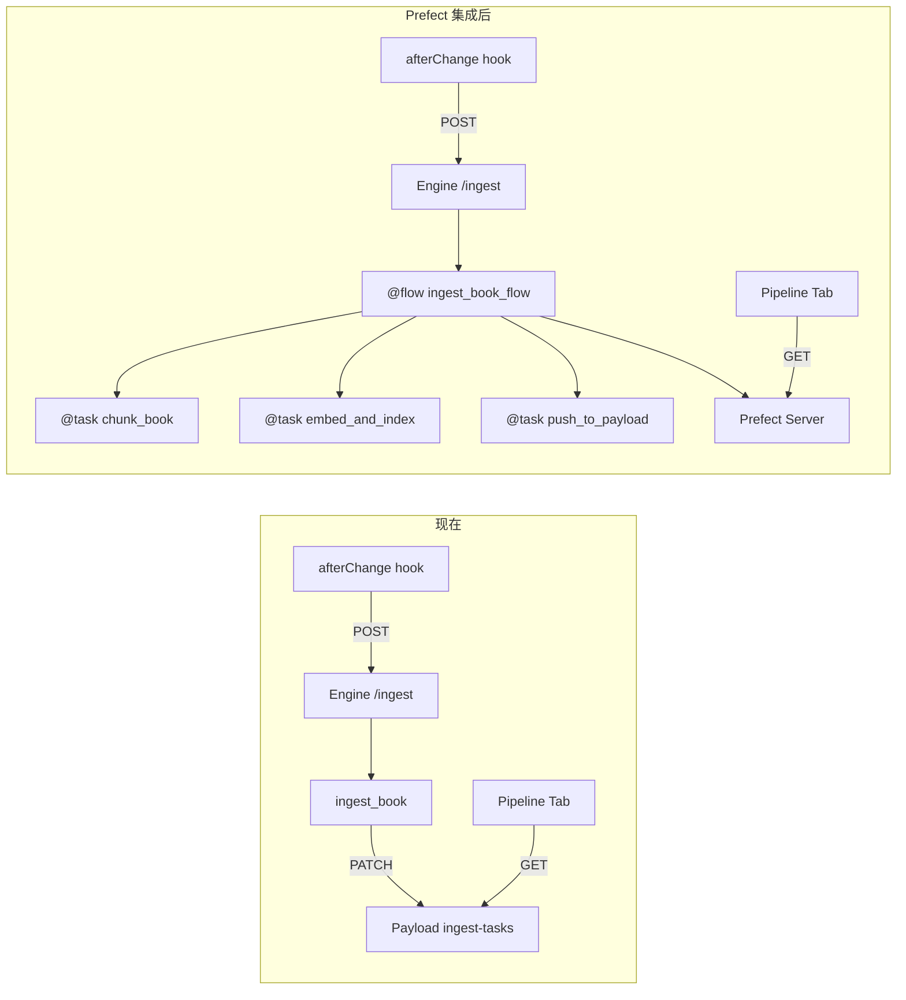
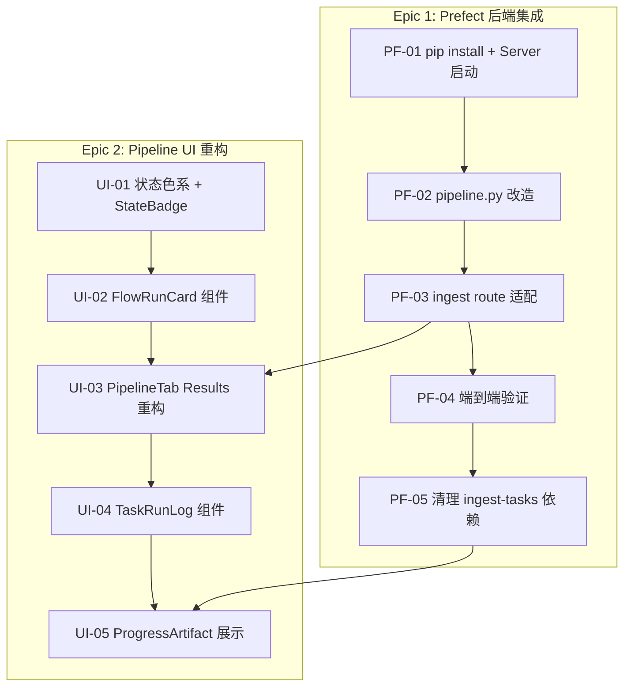

# Sprint Pipeline — Prefect 集成 + Pipeline UI 重构

> **来源**: Sprint Acquisition (AQ-08) 实施期间发现 pipeline 追踪需要专业编排框架
>
> **问题**: 手动维护 `ingest-tasks` collection + `_notify()` PATCH 调用脆弱且缺乏重试/日志/调度能力。Pipeline Tab Results 面板需要 backfill 历史数据才能正常显示。
>
> **决策**: 引入 [Prefect](https://github.com/PrefectHQ/prefect) (Apache 2.0) 作为 pipeline 编排层
>
> **参考**: `.github/references/prefect/` (已 clone)

## 概览

| Epic | Story 数 | 预估总工时 | 优先级 |
|------|----------|-----------|--------|
| **Prefect 后端集成** | 5 | 14h | P1 |
| **Pipeline UI 重构 (参考 Prefect UI)** | 5 | 16h | P1 |
| **合计** | **10** | **30h** | P1 |

## 技术栈对齐

> 项目与 Prefect UI 技术栈 **完全一致**，组件可直接复用。

| 维度 | 你的项目 | Prefect UI | 兼容性 |
|------|---------|------------|--------|
| Tailwind | v4.2.2 | v4.2.2 | ✅ 完全一致 |
| shadcn/ui | ✅ (new-york) | ✅ (new-york) | ✅ 完全一致 |
| tailwind-merge | ✅ | ✅ | ✅ |
| Lucide React | ✅ | ✅ | ✅ |
| React | ✅ | 19.x | ✅ |
| Radix UI | ✅ | ✅ | ✅ |

## 架构变更

```
变更前:
  FastAPI ingest_book() → 手动 _notify() → PATCH /api/ingest-tasks → Payload CMS

变更后:
  FastAPI → Prefect @flow/@task → Prefect Server (SQLite) → 前端调 Prefect REST API
```



## 依赖图



---

## Epic 1: Prefect 后端集成 (5 stories, 14h)

### [PF-01] Prefect 安装 + 本地 Server 启动

**类型**: Backend/DevOps · **优先级**: P1 · **预估**: 2h

**描述**: 安装 Prefect、配置本地 Server、验证 API 可用。

**验收标准**:
- [ ] `pip install prefect` 加入 `requirements.txt` / `pyproject.toml`
- [ ] `prefect server start` 可在本地启动 (http://localhost:4200)
- [ ] `.env` 新增 `PREFECT_API_URL=http://localhost:4200/api`
- [ ] `examples/hello_world.py` 跑通，Prefect UI 可看到 flow run
- [ ] 文档: 启动命令加入 dev workflow

**参考**: `.github/references/prefect/examples/hello_world.py`

**文件**:
```
修改
├── requirements.txt / pyproject.toml   → 新增 prefect
├── .env.example                         → 新增 PREFECT_API_URL
├── .agent/workflows/dev.md             → 启动步骤新增 prefect server
```

---

### [PF-02] pipeline.py 改造 — @flow + @task 包装

**类型**: Backend · **优先级**: P1 · **预估**: 4h

**描述**: 将 `engine_v2/ingestion/pipeline.py` 的 `ingest_book()` 函数拆分为 Prefect flow + tasks。保留现有逻辑，仅用装饰器包装。

**改造对照**:

| 现有函数 | Prefect 改造 | 对应阶段 |
|---------|-------------|---------|
| `reader.load_data()` | `@task chunk_book()` | chunked |
| TOC extraction | `@task extract_toc()` | toc |
| BM25 indexing | `@task build_bm25()` | bm25 |
| `IngestionPipeline.run()` | `@task embed_and_index()` | embeddings + vector |
| `_push_chunks_to_payload()` | `@task push_to_payload()` | 后处理 |
| `_notify()` 系列调用 | 删除 — Prefect 自动追踪 | — |

**验收标准**:
- [ ] `pipeline.py` 中 `ingest_book()` 改为 `@flow(name="ingest-book")`
- [ ] 5 个阶段各自为 `@task`，带 `retries` 和 `log_prints=True`
- [ ] 移除所有 `_notify()` / `_update_task()` 调用
- [ ] `create_progress_artifact()` 替代进度汇报
- [ ] 保持书本状态更新 (`Books.status` → indexed)

**参考**: `.github/references/prefect/examples/run_api_sourced_etl.py`

**文件**:
```
修改
├── engine_v2/ingestion/pipeline.py     → @flow/@task 重构
新建
├── engine_v2/ingestion/tasks.py        → 独立 task 函数 (可选拆分)
```

---

### [PF-03] ingest route 适配 — 异步触发 Prefect flow

**类型**: Backend · **优先级**: P1 · **预估**: 2h

**描述**: 修改 `engine_v2/api/routes/ingest.py`，将 `background_tasks.add_task(ingest_book)` 改为 Prefect flow 调用。返回 `flow_run_id` 供前端查询。

**验收标准**:
- [ ] `POST /engine/ingest` → 启动 Prefect flow run，返回 `{ flow_run_id }`
- [ ] `POST /engine/ingest-async` → 异步提交 flow run (`.submit()`)
- [ ] `GET /engine/ingest/status/{flow_run_id}` → 代理查询 Prefect 状态
- [ ] afterChange hook 调用后能在 Prefect UI 看到 flow run

**文件**:
```
修改
├── engine_v2/api/routes/ingest.py      → flow 调用方式
├── hooks/books/afterChange.ts          → 存储 flow_run_id 到 Book metadata
```

---

### [PF-04] 端到端验证

**类型**: Testing · **优先级**: P1 · **预估**: 2h

**描述**: 上传一本新 PDF，验证全链路：UI 上传 → afterChange → Engine → Prefect flow → ChromaDB → Pipeline Tab 展示。

**验收标准**:
- [ ] 新书上传 → Prefect UI 出现 flow run
- [ ] 每个 task (chunk/toc/bm25/embed/vector) 独立记录
- [ ] flow run 完成后 Book.status = indexed
- [ ] Prefect UI 可查看日志、耗时、参数
- [ ] 失败时自动重试 (至少 chunked 阶段演示)

---

### [PF-05] 清理 ingest-tasks 依赖

**类型**: Cleanup · **优先级**: P2 · **预估**: 4h

**描述**: 迁移完成后，清理 `ingest-tasks` collection 的前端/后端依赖。

**验收标准**:
- [ ] `PipelineTab.tsx` 数据源切换到 Prefect REST API
- [ ] `afterChange.ts` 不再创建 ingest-tasks 记录
- [ ] `IngestTasks.ts` collection 可选保留（向后兼容）或标记 deprecated
- [ ] `_notify()` / `_update_task()` 函数删除

**文件**:
```
修改
├── features/engine/acquisition/components/PipelineTab.tsx → Prefect API
├── hooks/books/afterChange.ts                            → 移除 ingest-tasks 创建
├── engine_v2/ingestion/pipeline.py                       → 移除 _notify
删除 (可选)
├── collections/IngestTasks.ts                            → 标记 deprecated
```

---

## Epic 2: Pipeline UI 重构 (5 stories, 16h)

> **设计参考**: `.github/references/prefect/ui-v2/src/components/`
>
> 技术栈完全一致 (Tailwind v4 + Lucide + React)，可直接借鉴组件模式。

### [UI-01] 状态色系 + StateBadge 组件

**类型**: Frontend · **优先级**: P1 · **预估**: 2h

**描述**: 参考 Prefect UI 的 `state-badge` 组件，建立统一状态色系和 `StateBadge` 组件。

**色系设计 (从 Prefect 提取)**:
```css
/* globals.css 新增 */
--state-completed: oklch(0.72 0.19 142);   /* 绿 */
--state-running:   oklch(0.62 0.19 250);   /* 蓝 */
--state-failed:    oklch(0.58 0.22 27);    /* 红 */
--state-pending:   oklch(0.55 0.02 260);   /* 灰 */
--state-scheduled: oklch(0.75 0.18 85);    /* 黄 */
```

**验收标准**:
- [ ] `globals.css` 新增 `--state-*` 全套 CSS 变量 (100/200/600/700 色阶)
- [ ] `shared/components/StateBadge.tsx` — icon + 文字 + 背景色 badge
- [ ] `shared/components/StateIcon.tsx` — 纯 icon + tooltip
- [ ] 5 种状态: COMPLETED / RUNNING / FAILED / PENDING / SCHEDULED
- [ ] Storybook or 页面验证颜色

**参考**: `.github/references/prefect/ui-v2/src/components/ui/state-badge/index.tsx`

**文件**:
```
新建
├── features/shared/components/StateBadge.tsx
├── features/shared/components/StateIcon.tsx
修改
├── src/app/(frontend)/globals.css          → 状态色系变量
```

---

### [UI-02] FlowRunCard 组件

**类型**: Frontend · **优先级**: P1 · **预估**: 3h

**描述**: 参考 Prefect 的 `flow-run-card`，创建 Pipeline 执行记录卡片——左侧彩色边框 + 状态/名称/时间/耗时行。

**验收标准**:
- [ ] `PipelineRunCard.tsx` — 左侧 `border-l-4` 状态色 + 3 行信息
- [ ] 行 1: Flow name + StateBadge
- [ ] 行 2: 开始时间 + 耗时 + task 数量
- [ ] 行 3: 参数 (book_id, category)
- [ ] 点击 → 展开 task 详情

**参考**: `.github/references/prefect/ui-v2/src/components/flow-runs/flow-run-card/flow-run-card.tsx`

**文件**:
```
新建
├── features/engine/acquisition/components/PipelineRunCard.tsx
```

---

### [UI-03] PipelineTab Results 面板重构

**类型**: Frontend · **优先级**: P1 · **预估**: 4h

**描述**: 将 Results 面板从 ingest-tasks 查询切换为 Prefect flow_runs API。展示 FlowRunCard 列表 + 详情钻取。

**数据源变更**:
```
Before: GET /api/ingest-tasks?where[book][equals]={bookId}
After:  POST http://localhost:4200/api/flow_runs/filter
        { flow_runs: { name: { like_: "ingest-book" }, parameters: { book_id: N } } }
```

**验收标准**:
- [ ] Results 面板展示 `PipelineRunCard` 列表 (最近 10 次 runs)
- [ ] 每条 run 可展开看 task runs (chunk/toc/bm25/embed/vector)
- [ ] 运行中的 run 显示 ● Live 指示器 + 自动刷新
- [ ] 空态: "No pipeline runs yet" (替代 "No task records")

**文件**:
```
修改
├── features/engine/acquisition/components/PipelineTab.tsx   → Results 面板
├── features/engine/acquisition/api.ts                       → Prefect API 调用
├── features/engine/acquisition/types.ts                     → FlowRun / TaskRun 类型
```

---

### [UI-04] TaskRunLog 组件

**类型**: Frontend · **优先级**: P1 · **预估**: 4h

**描述**: 参考 Prefect 的 `task-run-logs`，创建终端风格日志面板，展示 task 执行的实时日志。

**验收标准**:
- [ ] `TaskRunLog.tsx` — 暗色终端风格 (monospace + 行号)
- [ ] 日志级别颜色 (INFO=白, WARNING=黄, ERROR=红)
- [ ] 时间戳前缀 `[HH:mm:ss]`
- [ ] 自动滚动到底部 + 手动暂停
- [ ] 日志搜索输入框 (可选)

**参考**: `.github/references/prefect/ui-v2/src/components/ui/run-logs/`

**文件**:
```
新建
├── features/engine/acquisition/components/TaskRunLog.tsx
```

---

### [UI-05] ProgressArtifact 展示

**类型**: Frontend · **优先级**: P2 · **预估**: 3h

**描述**: 读取 Prefect Artifacts API，在 Pipeline Tab 展示 progress bar 和 table artifacts。

**验收标准**:
- [ ] 读取 `GET /api/artifacts/filter` 获取 progress / table artifacts
- [ ] Progress artifact → 进度条组件 (带百分比标签)
- [ ] Table artifact → 数据表格 (chunk stats / vector counts)
- [ ] Markdown artifact → 渲染为 rich text

**文件**:
```
新建
├── features/engine/acquisition/components/PipelineArtifacts.tsx
修改
├── features/engine/acquisition/api.ts   → Prefect Artifacts API
```

---

## 质量门禁

| # | 检查项 | 判定依据 |
|---|--------|----------|
| G1 | **Prefect 可独立启停** | Engine 不依赖 Prefect Server 启动 — 无 Server 时 flow 仍可本地执行 |
| G2 | **状态色系统一** | 所有状态展示使用 `StateBadge` / `StateIcon`，不允许 inline color |
| G3 | **API 边界清晰** | 前端只调 Prefect REST API (flow_runs/task_runs/artifacts)，不直接调 Engine pipeline |
| G4 | **向后兼容** | 旧书的 `Books.pipeline` 字段仍可读取，Prefect 仅用于新任务 |

## 后端新增依赖

| 包 | 版本 | 用途 |
|----|------|------|
| `prefect` | ≥3.0 | 工作流编排 |

## 前端新增依赖

无新增 — 使用现有 Tailwind v4 + Lucide + fetch。
