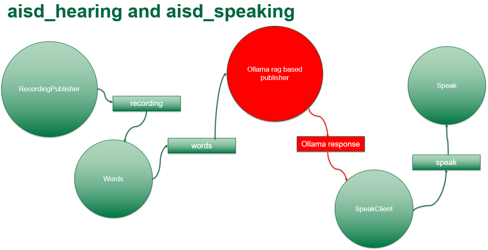

# CST8507: Natural Language Processing — Assignment 2

**Personalized Robot Vocal Interaction Package Using Retrieval-Augmented Generation (RAG)**

**Source:** `CST 8507_Assignemnt 2 _2026+Ali_V2.pdf`
**Type:** Group Project (20%)

---

## Overview

In this assignment, you will design and build a Robot Vocal Interaction Package using ROS2, building upon the work completed in CST8504 Applying AI (Assignment 3). When you have completed this assignment, you will know how to:

- Pull and configure an Ollama language model for local conversational AI.
- Implement Retrieval-Augmented Generation (RAG) using a local knowledge file of your choice (e.g., Create® 3 documentation, History of Canada, History of AI, general legal information, Education, medical, etc.) to ground the robot's responses in a specific knowledge domain.
- Once you are satisfied with the performance of the responses, you will convert your model into a ROS 2 node that subscribes to the output of the Whisper model and publishes its responses to the text-to-speech node (i.e., gTTS) to convert them into speech.
- Run `colcon build` (in the workspace directory, NOT inside the package) to rebuild packages ready to run.
- Spin up hearing and speaking Nodes with command line and test them out.
- Save your package as a zip folder and submit it through Brightspace.

The project can be done in two parts:

- **Part 1:** Implementing the RAG code in any IDE you prefer and test your response. You can do Part 1 on your personal laptop. Once everything works fine, you can start Part 2.
- **Part 2:** You need to use your loaner laptop and convert your code to a ROS2 Node and introduce it to the workflow of CST8504 Applying AI (Assignment 3). Detailed instructions will be provided in Part 2 of this document.

### Objectives

1. Understand and Deploy Local Large Language Models.
2. Design and Implement a Retrieval-Augmented Generation (RAG) Pipeline.
3. Engineer an End-to-End Conversational AI System in ROS2.
4. Evaluate System Performance.

**📝 Notes:**

> [Add your notes here]

---

## Part 1

### 1. Select a Topic

You will need to select a specific topic for which you want to develop the question answering system. You can choose only one of the following topics:

- **Educational question answering:** Develop a system that can answer educational questions in a specific area, such as history, mathematics, or biology for a specific education level.
- **General knowledge question answering:** Develop a system that can answer general knowledge questions, such as trivia, history, or science.
- **News question answering:** Develop a system that can answer questions about current events, such as the latest news on politics, sports, or entertainment.

### 2. Collect and Preprocess Data

You will need to collect a dataset of documents related to the selected topic from reliable sources. Save the text in a single file or multiple files in a folder. The dataset should be large enough to cover a wide range of queries that a user may ask. You will then need to preprocess the data by cleaning, tokenizing, and normalizing the text.

### 3. Pulling Ollama in Your Machine

You can begin this part by creating an Anaconda environment, similar to the one you used in previous labs and assignments, as shown below:

```bash
conda create -n rag_env python=3.10
conda activate rag_env
```

We will need to install the needed libraries (NumPy, matplotlib, etc.). To install Ollama you need to follow the instructions from this link: <https://ollama.com/download/linux> depending on the OS of the personal computer.

To verify the installation of Ollama:

```bash
aisd@aisd:~$ ollama --version
# Expected output:
# ollama version is 0.14.2
```

To pull an Ollama model, use `ollama pull <model_name>` by replacing `<model_name>` with the desired model name. You can explore available models at <https://ollama.com/library>.

> **Note:** You must select a model with a low memory footprint. In Part 2, three AI components will run together (Whisper, Ollama, and gTTS), so the goal of Part 1 is to develop a RAG-based chatbot using an Ollama model with memory usage below **1.5 GB**. A recommended starting point is `qwen2.5:0.5b`, which has a model size of approximately 0.4 GB.

An example on how to use Ollama (after running `ollama serve` in your terminal):

```python
from ollama import Client, ResponseError

try:
    client = Client(
        host='http://localhost:11434',
        headers={}
    )

    response = client.chat(
        model='gemma2:2b',
        messages=[{
            'role': 'user',
            'content': 'Describe why Ollama is useful',
        }]
    )

    print(response['message']['content'])
except ResponseError as e:
    print('Error:', e.error)
```

_This example was taken from [Using offline AI models for free in your Python scripts with Ollama](https://medium.com/@andres.alvarez.iglesias/using-offline-ai-models-for-free-in-your-phyton-scripts-with-ollama-9b995363b716)_

### 4. RAG Implementation

Each group must select a knowledge domain based on their intended application. The chosen domain will serve as the foundation for building the RAG node. In addition, students are required to select an appropriate RAG architecture (e.g., vector-based retrieval, hybrid retrieval, or framework-based approaches such as LangChain or LlamaIndex) and install all necessary external libraries needed to support the implementation.

- Ensure that answers are generated based only on the content of your documents, not external sources.
- The system should accept natural language questions.
- It should provide accurate, relevant, and context-aware answers derived from your document set.
- Test the model with multiple queries to evaluate accuracy and relevance. Include examples where the answer requires synthesizing information from multiple documents.

**📝 Notes:**

> [Add your notes here]

### 5. User Interface

You are required to create a simple user interface (UI) for your RAG-based question-answering system. The interface should allow a user to:

- **Input a Question:** Provide a text box or prompt where the user can type a natural language question.
- **System Answer:** Display the answer generated by your model based on the documents you collected.
- **Source Documents:** Show the document(s) that were used to generate the answer. This is to ensure transparency and traceability of the response.

You may use any framework or library you are comfortable with (e.g., Python + Streamlit, Flask, Gradio, or a simple web app). The interface should be interactive and responsive, allowing multiple questions in a single session.

### 6. Evaluation

To evaluate the performance of the system, compare the system's responses against human-annotated answers:

- Prepare a set of **20 questions** relevant to your domain.
- Run the system on these questions and record answers.
- Manually assess correctness (e.g., 1 = correct, 0.5 = partially correct, 0 = incorrect).
- For each test question, list the top 3 retrieved documents and mark whether they are relevant or not.
- Calculate an average "accuracy" score based on your assessment.

### 7. Converting Your Python Code to Object-Oriented Programming

In order to convert your code to a ROS2 Node later, it is necessary to convert your code to the OOP framework. You can look at one of the ROS2 nodes you used before in CST8504.

**📝 Notes:**

> [Add your notes here]

---

## Part 2

**Building your RAG node and plugging it into the Architecture**

Assuming you have already completed Part 1 and your code is written in an object-oriented (OOP) style, you will now make a few modifications so it can be converted into an executable ROS 2 node that subscribes to the correct input topic and publishes the appropriate output messages.

### Step 1: Create Knowledge Directory

Navigate to your workspace directory and create a folder named `knowledge`:

```bash
mkdir knowledge
```

Your workspace should look as follows:

```
aisd@aisd:~/aisd_ali$ ls
aisd_hearing   aisd_msgs      aisd_vision   install   log
aisd_motion    aisd_speaking   build         knowledge
```

### Step 2: Add a New Python Script

Add a new Python script in the `aisd_hearing` package. Your node should be in the following path along with `word_publisher.py` and other nodes:

```
aisd@aisd:~/aisd_ali/aisd_hearing/aisd_hearing$ ls
__init__.py           recording_publisher.py   words_publisher.py
ollama_publisher.py   speak_client.py
```

### Step 3: Update Entry Points

In order to convert this Python code to an executable ROS2 node, you need to update the entry points of the `setup.py` file as follows:

```python
entry_points={
    'console_scripts': [
        'recording_publisher = aisd_hearing.recording_publisher:main',
        'words_publisher = aisd_hearing.words_publisher:main',
        'ollama_publisher = aisd_hearing.ollama_publisher:main',
        'speak_client = aisd_hearing.speak_client:main',
    ],
},
```

### Step 4: ROS2 Node Structure

The newly added entry point `ollama_publisher` allows ROS 2 to execute the `main()` function inside `ollama_publisher.py` when running the command `ros2 run aisd_hearing ollama_publisher`.

For your reference, your ROS2 node should have the following structure as a base implementation. Some notes to consider:

1. The node should **subscribe** to the topic called `words` (String), which is the output of the Whisper model. A response will then be generated and published. _(Highlighted in red in the original document)_
2. The node will **publish** its response as a String message on the topic called `ollama_reply`. _(Highlighted in green in the original document)_
3. It is useful to use **ROS 2 parameters** to define the path of the knowledge file and the name of the model. This allows you to change the Ollama model when running the command from the terminal: _(Highlighted in purple in the original document)_

```bash
ros2 run aisd_hearing ollama_publisher --ros-args -p model:=qwen2.5:0.5b
```

> **Important:** The given example is provided for your reference only; you must use the code you developed in Part 1.

**Base code:**

```python
#!/usr/bin/env python3

import os
import rclpy
from rclpy.node import Node
from std_msgs.msg import String
from ollama import Client


class OllamaPublisher(Node):
    def __init__(self):
        super().__init__('ollama_publisher')

        self.declare_parameter('model', 'llama3.2:latest')
        self.declare_parameter('rag_path',
            '/home/aisd/aisd_ali/knowledge/ragfile.txt')

        self.model = self.get_parameter('model').get_parameter_value().string_value
        self.rag_path = self.get_parameter('rag_path').get_parameter_value().string_value

        self.client = Client(host='http://localhost:11434')
        self.rag_context = ""

        if os.path.isfile(self.rag_path):
            try:
                with open(self.rag_path, 'r', encoding='utf-8') as f:
                    self.rag_context = f.read().strip()
                self.get_logger().info(f'Loaded RAG file: {self.rag_path}')
            except Exception as e:
                self.get_logger().error(f'Failed to read RAG file: {e}')
        else:
            self.get_logger().warn(f'RAG file not found: {self.rag_path}')

        self.pub = self.create_publisher(String, 'ollama_reply', 10)
        self.sub = self.create_subscription(String, 'words', self.cb, 10)
        self.busy = False

    def cb(self, msg: String):
        text = msg.data.strip()
        if text == "" or self.busy:
            return
        self.busy = True
        self.get_logger().info(f'WORDS: "{text}"')

        try:
            reply = self.ask_ollama(text)
        except Exception as e:
            self.get_logger().error(f'Ollama error: {e}')
            self.busy = False
            return

        reply = (reply or "").strip()
        if reply:
            out = String()
            out.data = reply
            self.pub.publish(out)
            self.get_logger().info(f'OLLAMA_REPLY: "{out.data}"')
        self.busy = False

    def ask_ollama(self, user_text: str) -> str:
        system_parts = [
            "Reply in one short helpful sentence."
        ]

        if self.rag_context:
            system_parts.append(
                "Use the following background facts as truth about the robot and project."
            )
            system_parts.append(self.rag_context)

        system_prompt = "\n\n".join(system_parts)
        res = self.client.chat(
            model=self.model,
            messages=[
                {"role": "system", "content": system_prompt},
                {"role": "user", "content": user_text},
            ],
        )
        return res["message"]["content"]


def main(args=None):
    rclpy.init(args=args)
    node = OllamaPublisher()
    rclpy.spin(node)
    node.destroy_node()
    rclpy.shutdown()


if __name__ == "__main__":
    main()
```

> **Tip:** If you don't have a GUI on your laptop, you can transfer the Python code to the loaner laptop using Putty as done in CST8504 Lab 1.

### Step 5: Rebuild the Package

Save the node and run `colcon build` from the workspace directory, not from inside any individual package.

> **⚠️ Important:** Make sure that the gTTS node now subscribes to the `ollama_reply` topic instead of the `words` topic from the Whisper model. Otherwise, you will hear your own voice echoed back instead of hearing the response generated by your RAG model.

### Step 6: Run the Nodes

Once everything looks good, spin up the following nodes (each in a separate terminal):

**1) Speak Service (TTS)**

```bash
source ~/aisd_ali/install/setup.bash
ros2 run aisd_speaking speak
```

**2) Recording Publisher**

```bash
source ~/aisd_ali/install/setup.bash
ros2 run aisd_hearing recording_publisher
```

**3) Words Publisher (Whisper STT)**

```bash
source ~/aisd_ali/install/setup.bash
ros2 run aisd_hearing words_publisher
```

**4) Ollama Model Response**

```bash
source ~/aisd_ali/install/setup.bash
ros2 run aisd_hearing ollama_publisher --ros-args -p model:=qwen2.5:0.5b
```

**5) Speak Client**

```bash
source ~/aisd_ali/install/setup.bash
ros2 run aisd_hearing speak_client
```

**📷 Architecture Diagram:**



The final architecture of the `aisd_hearing` and `aisd_speaking` packages with the new modification (shown in red) should be as above.

> **Remark:** The UI you built in Part 1 is not required for Part 2. The objective of Part 2 is to develop a package that can be installed on a robot's computer after some configuration of the speaker and microphone. However, if you are interested in building a dashboard/UI similar to what you did in Part 1 in ROS2, you can learn more about `ros2_webinterface` from the following repository: <https://github.com/sciotaio/robotics-ui>.

**📝 Notes:**

> [Add your notes here]

---

## Guidelines

- The assignment will be completed in **groups of 2**.
- All students should contribute equally and define their share of work.
- All students will obtain the same grade from the assignment.
- The dataset should be collected by the team.

> It is important to start working on this assignment early. Start reading the textbook, some of its suggested follow-up material, conference proceedings, journals, and papers available from the Web, early enough to settle quickly on a subject of interest to you.

---

## Required Deliverables

### Proposal (Due: February 27th)

A 1–2 page document outlining the problem, your approach, possible dataset(s) and/or software systems to use. The assignment proposal should include at least the following items:

- What topic you want to address, and the motivation.
- **Team Details:** Include the names.
- What dataset(s) you plan to use; describe the procedure and the source data.
- Provide a title for your assignment.
- **Plan of Work:** In brief, provide a rough outline of the major milestones of the assignment, and a rough estimate for when you estimate you will achieve it.
- Try to answer the following questions as well:
  - What result do you hope to get?
  - Why is it interesting?

### Final Report (Due: April 3rd)

The final assignment report is typically expanded from the assignment proposal. Your final report is a **6–10 page** document that describes your assignment and final results.

#### Sample Outline for Your Final Report

- **Abstract:**
  Summarize the main components of your work in one paragraph (no more than 5 sentences). What problem are you solving? What is the key to your approach? What results did you achieve? Your abstract should draw the reader in and interest them in reading the rest of your paper to understand the details of your work.

- **Introduction:**
  Explain the problem, motivate it (why is it important?), and briefly describe your approach. State a research question that your assignment seeks to answer: what are you trying to learn from this research assignment? You may also report some of your results without discussing the details of your method.

- **Dataset:**
  Provide a detailed description of the dataset you are using, including its purpose, structure, and key attributes. Clearly explain the source of the data, how it was collected, and any preprocessing steps applied.

- **Method:**
  Describe your approach to handling the problem. An overview of the framework, including the model design, training/inference algorithms, and any pre-/post-processing steps. Highlight the contributions of the proposed method or application (e.g., novelty/effectiveness/efficiency/simplicity). Also, any modeling assumptions you made.

- **Results:**
  Describe the experiments you ran and identify your method(s). Include the results you achieved. This section will probably also include some figures that summarize your results. Analyze your results (including your models).

- **Reproducibility Details:**
  To ensure that others can replicate your experiments, include the following:
  - **Platform and System Setup:** Outline the hardware and software configurations required.
  - **Execution Steps:** Provide a step-by-step guide on how to run the experiments.
  - **Source Code and Scripts:** Share all code files, scripts, and configurations used.
  - **Intermediate and Final Outputs:** Include key intermediate results and final output files for reference.

- **Challenges and Solutions:**
  Describe any difficulties you have encountered in your project and explain how you overcame these challenges.

- **Discussion and Future Work:**
  Discuss any implications of your analysis for the problem as a whole, and what are the next steps for future work. Any other concluding remarks should go here.

- **References:**
  Include all the sources you used in your work. Cite any research papers, books, datasets, or other materials that contributed to your study.

### Presentations (Due: April 3rd)

Prepare a **10-minute presentation**, followed by 10 minutes for questions. Ensure that your code is ready for discussion and has been thoroughly tested. Be prepared to demonstrate your implementation and address any test cases suggested by your professor during the presentation.

#### Slide Contents

| Slide(s)   | Content                                                                                                      |
| ---------- | ------------------------------------------------------------------------------------------------------------ |
| 1 slide    | Title and group members                                                                                      |
| 1–2 slides | **Introduction:** A brief overview of the project — the problem/task studied and why it's interesting/useful |
| 2–3 slides | **Method:** Descriptions of the method proposed, including motivation and concrete components                |
| 1–2 slides | **Evaluation:** The dataset and experiment settings for evaluation                                           |
| 1–2 slides | **Outcomes:** Summarize the results of your experiments                                                      |
| 1–2 slides | **Discussions:** Discuss any limitations or challenges encountered, and how they were addressed              |

#### Other Requirements

- All plots, figures, and tables must have a title, labeled axes, and a caption.
- Do not include multiple figures that all convey the same information.
- Do not include well-known algorithms. Cite when appropriate.
- Provide a title for your report.
- Divide your report clearly into sections/subsections.

---

## Submission Instructions

| Deliverable                       | Due Date          |
| --------------------------------- | ----------------- |
| Proposal (1–3 pages)              | **February 27th** |
| Final Report + all code + dataset | **April 3rd**     |
| PowerPoint Presentation           | **April 3rd**     |

- Submit code, dataset, and Final Report in a **Zip File**.
- Include your PowerPoint presentation.
- **One submission per group required.**

**📝 Notes:**

> [Add your notes here]

---

## Grading

| Component                       | Weight  |
| ------------------------------- | ------- |
| **Part 1 – RAG Implementation** | **65%** |
| **Part 2 – ROS 2 Integration**  | **25%** |
| **Report and Presentation**     | **10%** |

### Part 1 – RAG Implementation (65%)

- Selection of an appropriate knowledge domain
- Proper implementation of a Retrieval-Augmented Generation (RAG) architecture
- Correct integration with an Ollama model (low memory footprint)
- Demonstration of grounded responses (no hallucination outside the selected domain)
- Data correctly collected and clearly explains the data with strong detail: its source, its basic statistics (source, size, number of words/sentences/documents) and other important details

### Part 2 – ROS 2 Integration (25%)

- Successful conversion of the RAG model into a ROS 2 node
- Correct subscription to the `words` topic (Whisper output)
- Correct publication to the `ollama_reply` topic
- Successful execution of the full vocal interaction pipeline

### Report and Presentation (10%)

- Includes all the required information mentioned above

**📝 Notes:**

> [Add your notes here]
